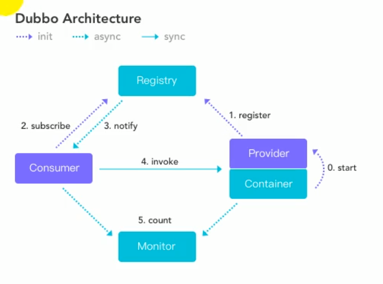

# Dubbo学习

## 一、应用架构的演变

1. 单体架构(ORM)：将所有功能写在一个应用中，将应用部署在一个服务器上，适用于小型应用
2. 垂直架构(MVC)：将应用拆成互不相干的小应用，每个应用单独部署到独立的服务器，适合稍大一点的应用
3. 分布式架构(RPC)：核心业务抽取，前后端分离，远程过程调用，适合较大项目
4. 流动计算架构(SOA)：调度治理中心基于访问压力实时管理集群容量，提高集群利用率

## 二、RPC的概念

**RPC**：远程过程调用，用于支持异构型分布式系统间的通讯

影响RPC框架性能的主要有两点：

1. 服务间建立连接的速度
2. 序列化与反序列化的速度

## 三、Dubbo概念

​	Dubbo是一款高性能、轻量级的开源Java RPC框架，它提供了三大核心能力：面向接口的远程方法调用，智能容错和负载均衡，以及服务自动注册和发现。



## 四、搭建注册中心

​	Dubbo通常使用zookeeper来搭建注册中心，阿里官方推出了新的开源注册中心 Nacos 来进行服务的注册管理。

本次采用zookeeper来搭建注册中心

1. 下载zookeeper安装包

2. 解压zookeeper安装包并在conf文件夹下创建zoo.cfg配置文件

3. 运行zkServer.cmd脚本启动zookeeper

4. 从github下载dubbo-admin源代码

   https://github.com/apache/dubbo-admin 

5. 解压源代码，打包项目

   ```
   mvn clean package
   
   ```

   


## Dubbo的负载均衡策咯

Dubbo主要支持多种负载均衡策咯

1. Random LoadBalance

    随机策略。按照概率设置权重，比较均匀，并且可以动态调节提供者的权重 

2.  RoundRobin LoadBalance 

    轮询策略。轮询，按公约后的权重设置轮询比率。会存在执行比较慢的服务提供者堆积请求的情况，比如一个机器执行的非常慢，但是机器没有挂调用（如果挂了，那么当前机器会从Zookeeper的服务列表删除），当很多新的请求到达该机器后，由于之前的请求还没有处理完毕，会导致新的请求被堆积，久而久之，所有消费者调用这台机器上的请求都被阻塞 

3.  LeastActive LoadBalance 

    最少活跃调用数。如果每个提供者的活跃数相同，则随机选择一个。在每个服务提供者里面维护者一个活跃数计数器，用来记录当前同时处理请求的个数，也就是并发处理任务的个数。所以如果这个值越小说明当前服务提供者处理的速度很快或者当前机器的负载比较低，所以路由选择时候就选择该活跃度最小的机器。如果一个服务提供者处理速度很慢，由于堆积，那么同时处理的请求就比较多，也就是活跃调用数目越大，这也使得慢的提供者收到更少请求，因为越慢的提供者的活跃度越来越大 

4.  ConsistentHash LoadBalance 

    一致性Hash策略。一致性Hash，可以保证相同参数的请求总是发到同一提供者，当某一台提供者挂了时，原本发往该提供者的请求，基于虚拟节点，平摊到其他提供者，不会引起剧烈变动 


## 服务降级

 在线网站一般都会有服务器压力剧增的时候，比如说网上商城的促销，这个时候常用的手段就是服务降级，根据当前业务情况及流量对一些服务和页面有策略的降级，以此缓解了服务器资源压力，以保证核心任务的正常运行，同时也保证了部分甚至大部分客户得到正确响应 

**降级实施策略**

1. 页面拒绝服务：页面提示由于服务繁忙此服务暂停。跳转到varnish或nginx的一个静态页面。
2. 服务接口拒绝服务：无用户特定信息的页面能访问，提示服务器繁忙。页面内容也可在缓存（Varnish）或CDN内获取。
3. 延迟持久化：页面访问照常，但是涉及记录变更，会提示稍晚能看到结果，将数据记录到异步队列或log，服务恢复后执行。
4. 随机拒绝服务：服务接口随机拒绝服务，让用户重试，目前较少采用。因为用户体验不佳。

## 集群容错

**Failover Cluster：失败重试**

当服务消费方调用服务提供者失败后自动切换到其他服务提供者服务器进行重试。这通常用于读操作或者具有幂等的写操作，需要注意的是重试会带来更长延迟。可通过 retries="2" 来设置重试次数（不含第一次）。

接口级别配置重试次数方法 <dubbo:reference retries="2" /> ，如上配置当服务消费方调用服务失败后，会再重试两次，也就是说最多会做三次调用，这里的配置对该接口的所有方法生效。当然你也可以针对某个方法配置重试次数如下：

```
<dubbo:reference>
    <dubbo:method name="sayHello" retries="2" />
</dubbo:reference>
```

**Failfast Cluster：快速失败**

当服务消费方调用服务提供者失败后，立即报错，也就是只调用一次。通常这种模式用于非幂等性的写操作。

**Failsafe Cluster：失败安全**

当服务消费者调用服务出现异常时，直接忽略异常。这种模式通常用于写入审计日志等操作。

**Failback Cluster：失败自动恢复**

当服务消费端用服务出现异常后，在后台记录失败的请求，并按照一定的策略后期再进行重试。这种模式通常用于消息通知操作。

**Forking Cluster：并行调用**

当消费方调用一个接口方法后，Dubbo Client会并行调用多个服务提供者的服务，只要一个成功即返回。这种模式通常用于实时性要求较高的读操作，但需要浪费更多服务资源。可通过 forks="2" 来设置最大并行数。

**Broadcast Cluster：广播调用**

当消费者调用一个接口方法后，Dubbo Client会逐个调用所有服务提供者，任意一台调用异常则这次调用就标志失败。这种模式通常用于通知所有提供者更新缓存或日志等本地资源信息


# Dubbo原理

## 一、框架设计

  

- **config 配置层**：对外配置接口，以 `ServiceConfig`, `ReferenceConfig` 为中心，可以直接初始化配置类，也可以通过 spring 解析配置生成配置类
- **proxy 服务代理层**：服务接口透明代理，生成服务的客户端 Stub 和服务器端 Skeleton, 以 `ServiceProxy` 为中心，扩展接口为 `ProxyFactory`
- **registry 注册中心层**：封装服务地址的注册与发现，以服务 URL 为中心，扩展接口为 `RegistryFactory`, `Registry`, `RegistryService`
- **cluster 路由层**：封装多个提供者的路由及负载均衡，并桥接注册中心，以 `Invoker` 为中心，扩展接口为 `Cluster`, `Directory`, `Router`, `LoadBalance`
- **monitor 监控层**：RPC 调用次数和调用时间监控，以 `Statistics` 为中心，扩展接口为 `MonitorFactory`, `Monitor`, `MonitorService`
- **protocol 远程调用层**：封装 RPC 调用，以 `Invocation`, `Result` 为中心，扩展接口为 `Protocol`, `Invoker`, `Exporter`
- **exchange 信息交换层**：封装请求响应模式，同步转异步，以 `Request`, `Response` 为中心，扩展接口为 `Exchanger`, `ExchangeChannel`, `ExchangeClient`, `ExchangeServer`
- **transport 网络传输层**：抽象 mina 和 netty 为统一接口，以 `Message` 为中心，扩展接口为 `Channel`, `Transporter`, `Client`, `Server`, `Codec`
- **serialize 数据序列化层**：可复用的一些工具，扩展接口为 `Serialization`, `ObjectInput`, `ObjectOutput`, `ThreadPool`


## 二、启动解析、加载配置信息

1. 解析xml文件配置

   通过DubboBeanDefinitionParser类来进行标签的解析

2. 解析配置类配置

   通过DubboNamespaceHandler类来解析配置类中设置的属性

## 三、服务暴露


## 四、服务引用

创建一个代理对象，客户端的引用使用代理对象，相当于原先在本地调用service对象，原先是直接将对象注入容器，现在是将代理对象注入到容器

## 五、服务调用

获取引用的对象，代理对象中获取相关信息，负载均衡，地址等。经过一系列的过滤器后，invoker远程的方法获取返回值。


