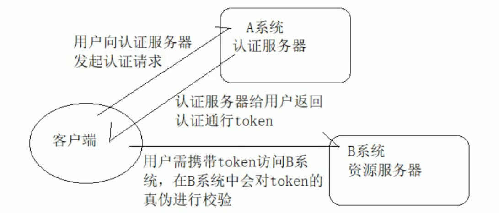

# Spring Security学习

## 一、权限管理相关概念

### 1.1 权限管理概念

权限管理一般指根据系统设置的安全规则或安全策略，用户可用访问而且只能访问自己被授权的资源。权限管理几乎出现在任何系统中。权限管理的前提是有用户的认证系统。

权限管理主要包括两个重要的部分：

1. 认证：通过用户名和密码成功登录系统后，让系统得到当前用户的角色信息

2. 授权：系统根据当前用户的角色，授予其可用操作的权限资源

权限管理一般有两种权限控制策略

1. 基于角色的权限控制：RBAC（role based access control）系统角色包括：总经理、部门经理等等，角色针对用户来划分。

   优缺点：角色是针对人划分的，人作为用户在系统中是活动资源，如果用户的权限出现变更，就需要去修改代码。如总经理突然也想看报表，就需要在if中添加角色。基于角色的访问控制不利于系统维护，可拓展性不高

2. 基于资源的权限控制：RBAC（resource based access control），资源在系统中是不变的，比如：类中的方法，页面中的按钮，访问这个按钮的权限是不会变的，变的只是你有没有这个权限，比如你一定要有查看工资这个资源的权限，你才可以查看。

   优缺点：系统设计的时候只需要去定义好权限标识符，如果用户的权限发生变更，需要添加或者删除，也只要通过权限修改模块把权限赋给这个角色，而不用去修改判断的逻辑代码，系统的拓展性更强。

### 1.2 完成权限管理需要三个对象

用户：主要包含用户名，密码和当前用户的角色信息，可用实现认证操作。

角色：主要包含角色名称，角色和当前角色所拥有的权限信息，可以实现授权操作。

权限：权限也可以称为菜单，主要包含当前权限名称，url地址等信息，可用实现动态菜单展示。

## 二、初识Spring Security

### 2.1 Spring Security概念

Spring Security是一个功能强大且高度可定制的身份验证和访问控制框架。它是用于保护基于Spring的应用程序的实际标准。

Spring Security是一个框架，致力于为Java应用程序提供身份验证和授权。与所有Spring项目一样，Spring Security的真正强大之处在于可以轻松扩展以满足自定义要求

### 2.2 Spring Security入门

#### 2.2.1 核心过滤器链

**SpringSecurity 采用的是责任链的设计模式，它有一条很长的过滤器链。现在对这条过滤器链的各个进行说明:**

1. SecurityContextPersistenceFilter：

   该过滤器主要使用SecurityContextRepository在session中保存或更新一个SecurityContext，并将此SecurityContext给后续的过滤器使用，为后续的过滤器建立所需的上下文。

   SecurityContext中存储了当前用户的认证和授权信息。

2. WebAsyncManagerIntegrationFilter：

   将 Security 上下文与 Spring Web 中用于处理异步请求映射的 WebAsyncManager 进行集成。

3. HeaderWriterFilter：

   用于将头信息加入响应中。

4. CsrfFilter：

   用于处理跨站请求伪造。Spring Security会对所有的post请求进行验证，判断是否包含系统生成的csrf的token信息，如果不包含就报错，起到防止csrf攻击的效果。

5. LogoutFilter：

   用于处理退出登录。清除认证信息。

6. UsernamePasswordAuthenticationFilter：

   用于处理基于表单的登录请求，从表单中获取用户名和密码。默认情况下处理来自 /login 的请求。从表单中获取用户名和密码时，默认使用的表单 name 值为 username 和 password，这两个值可以通过设置这个过滤器的usernameParameter 和 passwordParameter 两个参数的值进行修改。

7. DefaultLoginPageGeneratingFilter：

   如果没有配置登录页面，那系统初始化时就会配置这个过滤器，并且用于在需要进行登录时生成一个登录表单页面。

8. BasicAuthenticationFilter：

   检测和处理 http basic 认证。会自动解析http请求头部名字为Authentication，且以Basic开头的信息。

9. RequestCacheAwareFilter：

   用来处理请求的缓存。通过HttpSessionRequestCache内部维护了一个RequestCache，用于缓存HttpServletRequest。

10. SecurityContextHolderAwareRequestFilter：

    主要是包装请求对象request。使request具有更丰富的API。

11. AnonymousAuthenticationFilter：

    检测 SecurityContextHolder 中是否存在 Authentication 对象，如果不存在为其提供一个匿名 Authentication存放在SecurityContextHolder中。

12. SessionManagementFilter：

    管理 session 的过滤器，限制同一个用户开启多个会话的数量。

13. ExceptionTranslationFilter：

    处理 AccessDeniedException 和 AuthenticationException 异常。位于整个过滤链的后方，用于转换整个过滤链中出现的异常。

14. FilterSecurityInterceptor：

    可以看做过滤器链的出口。获取所配置资源的访问授权信息，根据SecurityContextHolder中存储的用户信息决定其是否有权限。

15. RememberMeAuthenticationFilter：

    当用户没有登录而直接访问资源时, 从 cookie 里找出用户的信息, 如果 Spring Security 能够识别出用户提供的remember me cookie, 用户将不必填写用户名和密码, 而是直接登录进入系统，该过滤器默认不开启。

    **spring security中不仅包含上述过滤器还有其他的一些过滤器，可以在配置文件中启用或关闭某些过滤器。**

    

#### 2.2.2 过滤器加载原理


#### 2.2.3 鉴权流程

1. 客户端发起一个请求，进入 Security 过滤器链。

2. 当到 LogoutFilter 的时候判断是否是登出路径，如果是登出路径则到 logoutHandler ，如果登出成功则到 logoutSuccessHandler 登出成功处理，如果登出失败则由 ExceptionTranslationFilter ；如果不是登出路径则直接进入下一个过滤器。

3. 当到 UsernamePasswordAuthenticationFilter 的时候判断是否为登录路径，如果是，则进入该过滤器进行登录操作，如果登录失败则到 AuthenticationFailureHandler 登录失败处理器处理，如果登录成功则到 AuthenticationSuccessHandler 登录成功处理器处理，如果不是登录请求则不进入该过滤器。

4. 当到 FilterSecurityInterceptor 的时候会拿到 uri ，根据 uri 去找对应的鉴权管理器，鉴权管理器做鉴权工作，鉴权成功则到 Controller 层否则到 AccessDeniedHandler 鉴权失败处理器处理。
   

## 三、项目搭建及细节分析

### 3.1 用户状态判断

spring security中账户认证有有多个状态，有一个状态为false即为认证失败

1. boolean enabled 是否可用

2. boolean accountNonExpired 账户是否生效

3. boolean credentialsNonExpired 密码是否生效

4. boolean accountNonLocked 账户是否锁定

   ```java
   return new User(user.getUsername(),
                       user.getPassword(),
                       sysUser.getStatus()==1,//是否可用
                       true,//账户是否生效
                       true,//密码是否生效
                       true,//账户是否锁定
                       authorities);
   ```

### 3.2 注销功能

spring security提供的默认的注销功能，请求/logout会直接弹出确认注销的界面，也可以实现自己的注销界面和注销接口。需要在配置中声明使用自定义的注销。

### 3.3 记住登录分析

实现记住登录需要表单中加上一个名字为remember-me的input，在选中后登录成功后会在浏览器cookie中写入一个token。remember-me的使用需要手动开启相关过滤器，点击注销会删除相关记住cookie。

token在cookies中存储右被盗取的风险，安全起见应该将相关信息保存到数据库中。

## 四、springboot整合springsecurity

### 4.1 引入springsecurity依赖

在创建的springboot项目中引入springsecurity依赖，这时springsecurity会自动开启登录过滤器，用户访问任何url都会要求先进行登录，登录的用户名为user密码是在启动tomcat时动态生成的，在打印的日志中可用看到。

```xml
<dependency>
    <groupId>org.springframework.boot</groupId>
    <artifactId>spring-boot-starter-security</artifactId>
</dependency>
```

### 4.2 自定义springsecurity配置

一般情况下我们不会使用spring security默认的登录界面，同时一般会使用数据库中的数据进行用户认证和授权，这需要我们对springsecurity进行一定的配置。

#### 4.2.1 创建配置类

自定义的spring security配置类可以继承WebSecurityConfigurerAdapter类并覆写里面的方法，在自定义的配置类中主要进行两项操作

1. 配置认证用户来源
2. 配置spring security相关信息

```java
@Configuration
@EnableWebSecurity
public class WebSecurityConfig extends WebSecurityConfigurerAdapter {
    
}
```

#### 4.2.2 配置认证用户来源（内存或数据库）

认证用户的信息一般可以从两个地方获取，内存或数据库中，实际应用中一般是从数据库中获取。配置认证用户来源需要覆写配置类中的**protected void configure(AuthenticationManagerBuilder auth) **方法，注意参数是**AuthenticationManagerBuilder** 类型。

tips：springsecurity会默认密码是加密的，直接使用明文密码可以自定义密码编码器或者在明文前加上{noop}

1. 认证来源为内存中时的配置

```java
@Override
protected void configure(AuthenticationManagerBuilder auth) throws Exception {
    //注意：使用自定义密码编码会以明文匹配密码，不使用明文会报错,内存验证
    auth.inMemoryAuthentication().passwordEncoder(new MyPasswordEncoder())
        .withUser("zxj").password("123456").roles("VIP")
        .and().withUser("tbszxj").password("123456").roles("CUT")
        .and().withUser("zxj123").password("123456").roles("CUT","VIP");
}
```

2. 认证来源为数据库时需要自己实现**UserDetailsService**接口中的方法

```java
//注入自定义userDetailService
@Bean
UserDetailsService userService(){
    return new UserServiceImpl();
}

@Override
protected void configure(AuthenticationManagerBuilder auth) throws Exception {
    //数据库验证,使用自定义用户认证服务
    //数据库中角色取名时一定要加上ROLE_
    //匹配角色时框架默认会加上ROLE_
    auth.userDetailsService(userService()).passwordEncoder(new BCryptPasswordEncoder());
}
```

```java
@Service
public class UserServiceImpl  implements UserService {

    @Autowired
    SysUserMapper sysUserMapper;

    @Autowired
    SysRoleMapper sysRoleMapper;

    @Override
    public UserDetails loadUserByUsername(String s) throws UsernameNotFoundException {
        try{
            //查询出自己的用户对象转换成spring security的对象
            SysUser sysUser = new SysUser();
            sysUser.setUsername(s);
            SysUser user = sysUserMapper.selectOne(sysUser);
            if(sysUser == null){
                return null;
            }
            //获取角色集合
            List<SimpleGrantedAuthority> authorities = new ArrayList<>();
            List<SysRole> sysRoles = sysRoleMapper.getRolesByUserName(s);
            for(SysRole role : sysRoles){
                authorities.add(new SimpleGrantedAuthority(role.getRoleName()));
            }
            return new User(user.getUsername(),
                    user.getPassword(),
                    user.getStatus()==1,
                    true,
                    true,
                    true,
                    authorities);
        }catch (Exception e){
            //认证失败
            return null;
        }
    }
}
```


#### 4.2.3 配置springsecurity相关信息

配置spring security相关信息主要包括

1. 释放静态资源
2. 指定资源拦截规则
3. 自定义认证界面
4. 自定义退出界面
5. csrf配置

```java
protected void configure(HttpSecurity http) throws Exception {
    //定制2请求授权规则
    http.authorizeRequests()
        //所有人都可以访问主页（释放静态资源）
        .antMatchers("/","/css/**","/image/**","/plugins/**").permitAll()
        //VIP可以访问level1(指定资源拦截规则)
        .antMatchers("/level1/**").hasRole("VIP")
        //CUT可以访问level2
        .antMatchers("/level2/**").hasRole("CUT")
        //YK可以访问level3
        .antMatchers("/level3/**").hasRole("YK");

    //开启自动配置的登录功能（自定义登录退出界面）
    http.formLogin();
        .loginPage("/login_page") //自定义登录界面
        .loginProcessingUrl("/sign_in") //自定义登录url
        .successForwardUrl("index") //成功后跳转界面
        .failureUrl("failer") //失败跳转界面
        .permitAll() //认证成功放行所有
        .and()
        .logout() 
        .logoutUrl("/logout") 
        .logoutSuccessUrl("login_page") //退出成功跳转界面    
        .invalidateHttpSession(true) //清空session    
        .permitAll() 
        .and()
        .csrf().disable(); //关闭csrf过滤    
    }
```


## 五、分布式认证

### 5.1 单点登录的概念

单点登录的实现分两大环节

1. 用户认证：这一环节主要是用户向认证服务器发起认证请求，认证服务器给用户返回一个成功的令牌token，主要在认证服务器中完成，即图中的A系统，注意A系统只能有一个。

2. 身份校验：这一环节是用户携带token去访问其他服务器，在其他服务器中要对token的真伪进行校验，主要在资源服务器中完成，即图B的系统，这里B系统可以有多个。

   

### 5.2 JWT介绍

单点登录的认证需要靠token实现，所有token的安全与否至关重要，直接关系到系统的安全性和健壮性。本次我们使用JWT来实现token的生成和校验。

**JWT生成的token由三部分组成**

1. 头部：主要设置一些规范信息，签名部分的编码格式就在头部中声明
2. 载荷：token中存放有效信息部分，比如用户名，角色信息，过期时间，不能放密码。
3. 签名：将头部与载荷分别采用base64编码后用 “ . ” 相连，再加盐，最后使用头部声明的编码类型进行编码就得到了签名。

**JWT生成的token的安全性分析**

从JWT生成的token组成来看，想要避免token被伪造就得看签名部分了，而签名部分的组成，其中的头部和载荷的base64编码几乎是透明的，毫无安全性可言。那么最终守护token安全的重担就落在了加入的盐上面了。

如果生成token的盐与解析token的盐一样那么大家就都可以用这个盐来解析token，就能用来伪造token。

这时需要对盐采用非对称加密的方式进行加密，以达到生成token与校验token所用的盐不一样的安全效果。

### 5.3 非对称加密RSA介绍

基本原理：同时生成两把密钥，公钥和私钥，私钥隐秘保存，公钥可以下发给信任客户端。

* 私钥加密：持有私钥或公钥才可以解密
* 公钥加密：持有公钥才可以解密

优点：安全，难以破解

缺点：算法比较耗时，为了安全可以接受

系统认证中认证服务器使用私钥加密，资源服务器使用公钥解密。

### 5.4 重写认证过滤器

继承UsernamePasswordAuthenticationFilter过滤器并重写其中的方法。

重写认证过滤器主要是修改获取账户和密码的方式，原先的默认过滤器是从表单中获取账户和密码，现在使用分布式登录时没有了表单，应修改为从请求体中获取账户和密码。将获取到的账户密码放到过滤器链中，以便后续使用。

```java
@Override
public Authentication attemptAuthentication(HttpServletRequest request, HttpServletResponse response) throws AuthenticationException {
        try{
            SysUser sysUser = new ObjectMapper().readValue(request.getInputStream(), 				SysUser.class);
            //原先的username和password是从form表单中解析出来的，现在从请求体获取
            UsernamePasswordAuthenticationToken authRequest = new 							UsernamePasswordAuthenticationToken(sysUser.getUsername(),sysUser.getPassword());
            return authenticationManager.authenticate(authRequest);
        }catch (Exception e){
            try{
                response.setContentType("application/json;charset=utf-8");
                response.setStatus(HttpServletResponse.SC_UNAUTHORIZED);
                PrintWriter out = response.getWriter();
                ApiResult<Void> apiResult = new ApiResult<>();
                apiResult.setMessage("用户名或密码错误");
                out.write(new ObjectMapper().writeValueAsString(apiResult));
                out.flush();
                out.close();
            }catch (Exception e1){
                logger.info(e1.getMessage());
            }
            throw new RuntimeException(e);
        }
    }
```

认证成功返回token给用户

```java
@Override
    public void successfulAuthentication(HttpServletRequest request, HttpServletResponse response, FilterChain chain, Authentication authResult) throws IOException, ServletException {
        SysUser user = new SysUser();
        user.setUsername(authResult.getName());
        List<String> authorities = new ArrayList<>();
        for(GrantedAuthority authority : authResult.getAuthorities()){
            authorities.add(authority.getAuthority());
        }
        user.setAuthorities(authorities);
        String token = JwtUtils.generateToken(user,properties.getPrivateKey(),24*60);
        response.addHeader("token",token);
        try{
            response.setContentType("application/json;charset=utf-8");
            response.setStatus(HttpServletResponse.SC_OK);
            PrintWriter out = response.getWriter();
            ApiResult<Void> apiResult = new ApiResult<>();
            apiResult.setMessage("认证成功");
            out.write(new ObjectMapper().writeValueAsString(apiResult));
            out.flush();
            out.close();
        }catch (Exception e1){
            logger.info(e1.getMessage());
        }
    }
```

### 5.5 重写验证过滤器

继承BasicAuthenticationFilter并重写其中的doFilterInternal方法。

获取用户请求时携带的token验证token是否合法，合法就将验证成功信息放到过滤器链中，否则返回失败信息

```java
    @Override
    public void doFilterInternal(HttpServletRequest request, HttpServletResponse response, FilterChain chain) throws IOException, ServletException {
        String header = request.getHeader("token");
        if(header != null){
            //token格式正确，进行验证
            PayLoad<SysUser> payload = JwtUtils.getInfoFromToken(header,properties.getPublicKey(), SysUser.class);
            SysUser sysUser = payload.getUserInfo();
            List<SimpleGrantedAuthority> authorities = new ArrayList<>();
            List<String> sysRoles = sysUser.getAuthorities();
            for(String role : sysRoles){
                authorities.add(new SimpleGrantedAuthority(role));
            }
            if(null != sysUser){
                UsernamePasswordAuthenticationToken authRequest = new UsernamePasswordAuthenticationToken(
                        sysUser.getUsername(),null,authorities);
                SecurityContextHolder.getContext().setAuthentication(authRequest);
                chain.doFilter(request,response);
            }
        }else{
            chain.doFilter(request,response);
            try{
                response.setContentType("application/json;charset=utf-8");
                response.setStatus(HttpServletResponse.SC_UNAUTHORIZED);
                PrintWriter out = response.getWriter();
                ApiResult<Void> apiResult = new ApiResult<>();
                apiResult.setMessage("请登录！");
                out.write(new ObjectMapper().writeValueAsString(apiResult));
                out.flush();
                out.close();
            }catch (Exception e1){
                logger.info(e1.getMessage());
            }
        }
    }
```

## 六、OAuth2相关

OAuth2是开放授权的一个标准，允许用户授权B应用不提供帐号密码的方式去访问该用户在A应用服务器上的某些特定资源。

### 6.1 OAuth2的四种授权模式

#### 6.1.1 授权码模式

授权码模式是四种模式中最繁琐也是最安全的一种模式。授权码code保证了token的安全性，即使授权码code被拦截，由于没有app_secret，也是无法通过授权码code获得token。（授权码是暴露在【A客户端】的，但使用授权码并不能直接访问【B】还需要【B】生成token才可以）


流程说明：【A服务客户端】需要用到【B服务资源服务】中的资源

1. 【A】将用户自动导航到【B】，这一步【A】需要提供一个回调地址，以备【B】返回授权码使用。
2. 用户点击授权按钮表示同意【A】使用【B】中资源，这一步需要用户登录【B】以表明用户有操作【B】中资源的权限。
3. 【B】生成授权码，通过第一步提供的回调地址返回給【A】。
4. 【A】携带上一步生成的授权码向【B】发送请求，获取通行凭证token。
5. 【B】给【A】返回令牌token和更新令牌refresh token

#### 6.1.2 隐式授权模式/简单模式

简化模式就是对授权码模式进行简化。没有了【A服务认证服务】这一部分，全部由【A服务客户端】与【B服务】交互，整个过程不在有授权码，token直接暴露在浏览器（存在安全风险）

1. 【A】将用户自动导航到【B服务认证服务】，这一步需要【A】提供一个回调地址，以备【B服务认证服务】返回token使用，还会携带一个【A】的状态表示state。
2. 用户点击授权按钮表示同意【A】使用【B资源服务】，这一步需要用户登录【B】以表明用户有操作【B】中资源的权限。
3. 【B服务认证服务】给【A】颁发token。（不推荐，必须【A】的可信度非常高才考虑）

#### 6.1.3 密码模式


1. 直接告诉【A】自己在【B】的用户名密码。
2. 【A】携带用户名密码向【B服务认证服务】发起请求获取token。
3. 【B服务认证服务】给【A】颁发token。


#### 6.1.4 客户端凭证模式

这种模式其实已经不太属于OAuth2的范畴了，A服务完全脱离了用户，以自己的身份去向B服务索取token。换言之，用户无需具备B服务的使用权限也可以。完全是【A服务】与【B服务】内部的交互与用户无关。

1. 【A】向【B】索取token。
2. 【B】返回token给【A】。


### 6.2 表结构

OAuth2认证的客户端信息一般是存储在数据库中的，spring security为OAuth2表结构设定了固定的结构，建表SQL地址

https://github.com/spring-projects/spring-security-oauth/blob/master/spring-security-oauth2/src/test/resources/schema.sql

