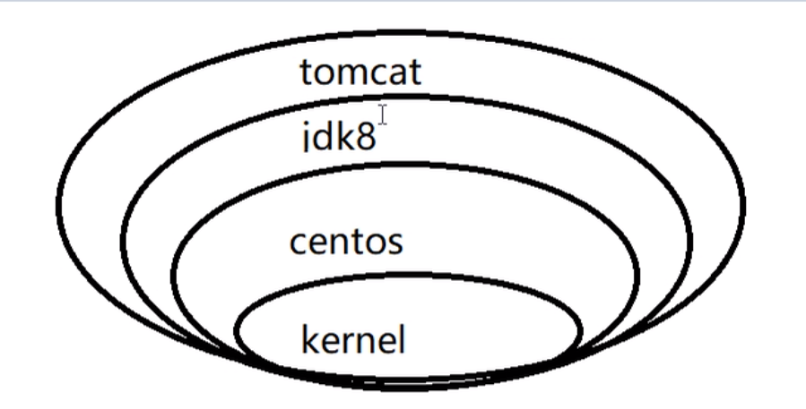

# docker学习

​	Docker 是一个开源的应用容器引擎，让开发者可以打包他们的应用以及依赖包到一个可移植的镜像中，然后发布到任何流行的 Linux或Windows 机器上，也可以实现虚拟化。容器是完全使用沙箱机制，相互之间不会有任何接口。

## docker的三要素

1. 镜像：一个只读模板，镜像可以用来创建容器，一个镜像可以创建很多个容器（类似于Java中的类）

2. 容器：docker利用容器来独立运行一个或一组应用。容器是用镜像创建的运行实例（类似于java中的对象）

3. 仓库：是集中存放镜像文件的场所。

   仓库注册服务器上往往有多个仓库，每个仓库右包含多个镜像，每个镜像右不同的标签（tag）。

## docker常用命令

### 一、辅助类命令

1. version：查看版本信息

   ```shell
   sudo docker version
   ```

2. info：比version更详细的安装信息

   ```shell
   sudo docker info
   ```

3. --help：帮助，查看所有命令和参数

   ```shell
   docker --help
   ```

### 二、镜像命令

1. images：查看本地的镜像

   ```shell
   sudo docker images
   ```

2. search：查找远程服务器上的镜像

   ```shell
   sudo docker search tomcat
   ```

3. pull：从远程服务器拉取镜像

   ```shell
   sudo docker pull tomcat
   ```

4. rmi：删除镜像

   ```shell
   sudo docker rmi hello-world
   ```

### 三、容器命令

1. run：新建并启动容器

   ```shell
   sudo docker run -it tomcat --name mytomcat
   参数说明：
   --name=“容器新名字”：为容器指定一个名称
   -d：后台运行容器，并返回容器id，
   -i：以交互模式运行容器，通常与-t同时使用
   -t：为容器重新分配一个伪输入终端，通常与-i同时使用
   -P：随机端口映射
   -p：指定端口映射，有以下四种格式
   	ip:hostPort:containerPort
   	ip::containerPort
   	hostPort:containerPort
   	containerPort
   ```

2. exit：退出容器

   ```shell
   sudo docker -exit		--容器停止退出
   
   ctrl+P+Q	--容器不停止退出
   ```

3. ps：列出运行的容器

   ```shell
   sudo docker ps
   参数说明：
   -a：列出所有当前正在运行的容器+历史上运行过的容器
   -l：显示最近创建的容器
   -n：显示最近创建的n个容器
   -q：静默模式，只显示容器编号
   --no-trunc：不截断输出
   ```

4. start：启动已被停止的容器

   ```shell
   sudo docker start mytomcat
   ```

5. stop：停止运行中的容器

   ```shell
   sudo docker stop mytoncat
   ```

6. rm：删除镜像

   ```shell
   sudo docker rm 镜像id
   ```

7. 重启容器

   ```shell
   sudo docker restart mytomcat
   ```

8. 守护式容器交互

   ```shell
   sudo docker run -d 容器名					   	 --启动守护式容器
   sudo docker logs -f -t --tail 容器id			--查看容器日志
   sudo docker top 容器id						--查看容器内的进程
   sudo docker inspect 容器id					--查看容器内部细节
   sudo docker exec -it 容器id 命令				--是在容器中打开新的终端，并且可以启动新的进程
   sudo docker attach 容器id						--直接进入容器启动命令终端，不会启动新的进程
   sudo docker cp 容器id:容器文件路径 宿主机路径 		--从容器内拷贝文件到宿主机
   ```

## 四、容器rootfs命令

1. commit： 从容器创建一个新的镜像 

   ```shell
   sudo docker commit -a "zxj" -m "mytest" 容器id 镜像名：标签
   参数说明
   -a :提交的镜像作者；
   -c :使用Dockerfile指令来创建镜像；
   -m :提交时的说明文字；
   -p :在commit时，将容器暂停。
   ```

   

# 镜像原理

**镜像是什么**

1. UnionFS（联合文件系统）

2. Docker镜像的加载

3. 镜像的分层

   

4. 为什么采用这种结构

   每个镜像的每一层都可以共享

# 容器数据卷

## 一、docker容器数据卷是什么

​		当我们在使用docker容器的时候，会产生一系列的数据文件，这些数据文件在我们关闭docker容器时是会消失的，但是其中产生的部分内容我们是希望能够把它给保存起来另作用途的，Docker将应用与运行环境打包成容器发布，我们希望在运行过程钟产生的部分数据是可以持久化的的，而且容器之间我们希望能够实现数据共享。

​		通俗地来说，docker容器数据卷可以看成使我们生活中常用的u盘，它存在于一个或多个的容器中，由docker挂载到容器，但不属于联合文件系统，Docker不会在容器删除时删除其挂载的数据卷。

特点：

1. 数据卷可以在容器之间共享或重用数据
2. 数据卷中的更改可以直接生效
3. 数据卷中的更改不会包含在镜像的更新中
4. 数据卷的生命周期一直持续到没有容器使用它为止
   

## 二、添加数据卷的两种方式

1. 直接通过命令行进行挂载

   命令

   ```shell
   docker run -it -v  /宿主机绝对路径目录:/容器内目录  镜像名
   ```

   查看数据卷是否挂载成功

   ```shell
   docker inspect  容器id
   ```

   命令（带权限），容器内目录只读

   ```shell
   docker run -it -v /宿主机绝对路径目录：/容器内目录 ：ro 镜像名
   ```

   tips：容器和宿主机之间数据共享，容器停止退出后，主机修改数据也能同步

2. 通过dockerFile添加

   创建dockerFile

   下面的dockerFile相当于命令行 docker run -it -v /宿主机目录路径 :  /生成的目录路径

   ```shell
   FROM  镜像名
   
   VOLUME ["/生成的目录路径"]  -- privileged=true
   
   CMD echo "success build"
   
   CMD /bin/bash
   ```

   执行dockerFile文件，生成新的镜像

   docker build和docker commit两个命令都可以建立docker镜像，后者需要在容器内进行，前者 不需要

   ```shell
   docker build -f  /docker/DockerFile -t  命名空间/镜像名
   ```

   tips：上述镜像创建的容器中的容器数据卷对应的主机目录默认为  /  也可以通过inspect命令查看

# 数据卷容器

## 一、什么是数据卷容器

​		docker容器数据卷，它的作用相当于生活中的活动硬盘，数据卷容器就相当于把多个活动硬盘再挂载到一个活动硬盘上，实现数据的传递依赖。

官网解析：命名的容器挂载数据卷，其他的容器通过挂载这个父容器实现数据共享，挂载数据卷的容器，我们称为数据卷容器。

创建数据卷父容器

```shell
docker run -it - -name parentContainer  镜像名				(镜像可为上述文件制作的镜像)
```

创建子容器继承父容器

```shell
docker run -it - -name sonContainer1 --volumes -from parentContainer 镜像名

docker run -it - -name sonContainer2 --volumes -from parentContainer 镜像名
```

tips：容器之间配信息的传递，数据卷的生命周期一直持续到没有容器使用它为止

# DockerFile

## 一、DockerFile是什么

