# jenkins学习

## 一、用户管理

1. 安装Role-based Authorization Strategy插件

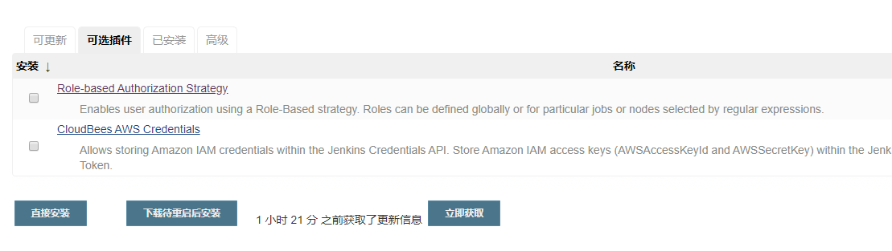

2. 在jenkins的全局安全配置里开启role-based策略，并保存

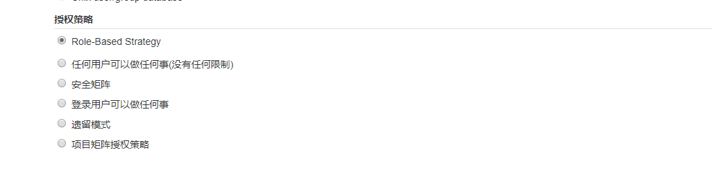

3. 管理并分配角色，例如可以创建一个基础角色，为其分配jenkins的基本权限，创建项目角色，设置可访问项目并赋予权限。

   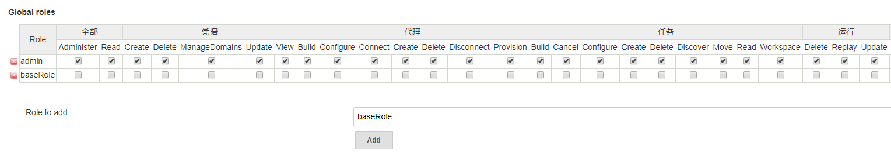

4. 创建新用户

   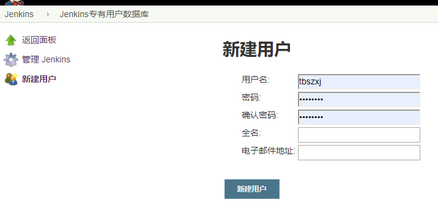

5. 为新用户授权，让用户只能看到其角色可以看到的项目

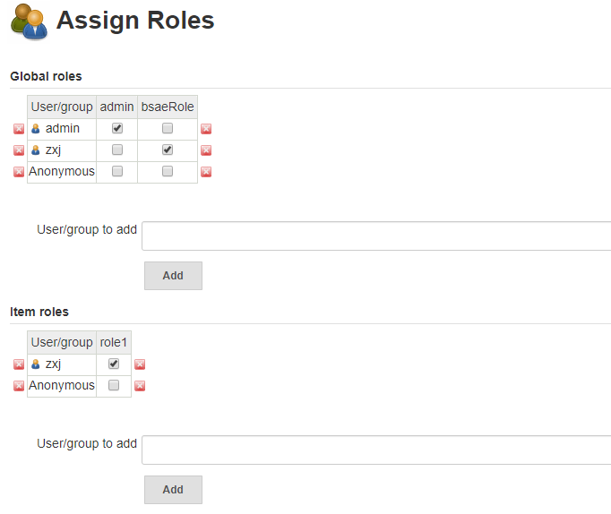

## 二、凭证管理

凭证可以用来存储需要密文保护的数据库密码，GitLab密码信息，Docker私有仓库密码等，以便jenkins可以和这些第三方应用交互。

1. 安装Credentials Binding Plugin。（推荐安装的插件已安装）

2. 添加凭据，主要有五种类型的凭据（账户名密码·，SSH私钥，密钥文件，密钥文本，证书）

   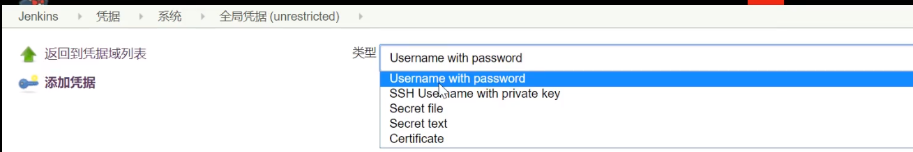

3. 使用添加的凭证，http拉去使用账户密码凭证，git拉去使用ssh私钥凭证

   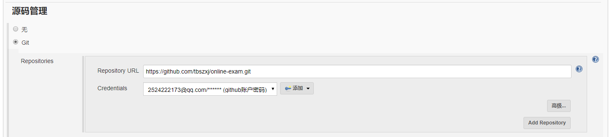

## 三、相关软件安装

1. 安装git

   ```she
   sudo apt install git -y
   ```

   

2. 安装maven

   ```shell
   sudo apt install maven -y
   ```

## 四、配置全局工具


主要包括配置jdk和配置maven

1. 配置jdk

   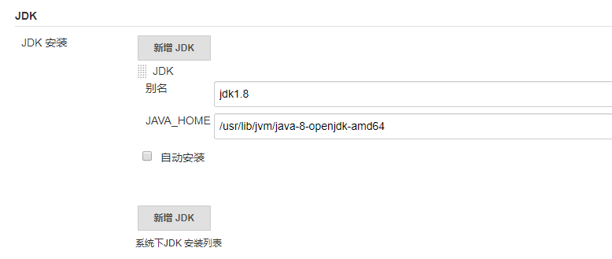

2. 配置maven

   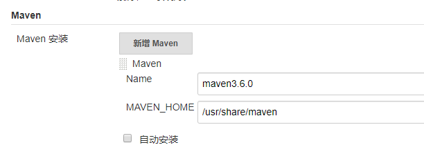

主要要将maven目录所属人改为jenkins启动用户,否则可能会造成jenkins找不到该目录或没有权限

```shell
sudo chown -R zxj /usr/share/maven
```

## 五、系统配置

1. 新增一些环境变量

   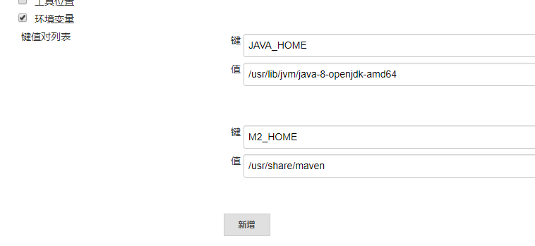

## 六、为tomcat开启账户权限，允许远程登录

修改conf/tomcat-users.xml配置文件，新增角色和用户

```shell
<role rolename="tomcat"/>
<role rolename="role1"/>
<user username="zxj" password="970708.@" roles="tomcat,role1"/>
```

修改webapps/manager/META-INF/context.xml允许远程登录

```shell
注释掉该句
<--
  <Valve className="org.apache.catalina.valves.RemoteAddrValve"
          allow="127\.\d+\.\d+\.\d+|::1|0:0:0:0:0:0:0:1" />
  -->
```


## 七、构建项目类型介绍

jenkins中自动构建项目类型有很多，常用的有三种

1. 自由风格软件项目（FreeStyle Project）
2. Maven项目（Maven Project）
3. 流水线项目（Pipeline Project）

每种类型的构建其实都可以完成一样的构建过程和构建结果，只是在操作方式、灵活度等方面有所区别，在实际开发中可以根据自己的需要和习惯来选择（PS：常推荐使用流水线，灵活度非常高）

### 7.1 自由风格项目构建

自由风格的项目在构建时可以写一些用于构建的shell脚本，不仅可以使用mvn还可以是其他

1. 拉取代码，使用git拉取

   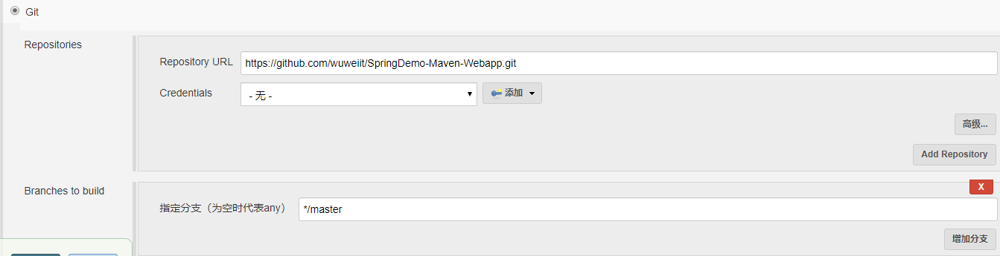

2. 编译打包

   构建->添加构建步骤->Executor Shell

   ```shell
   echo "开始编译打包"
   mvn clean package
   echo "编译和打包完成"
   ```

3. 部署

   安装插件deploy to container

   构建后操作->Deploy war/ear to container

   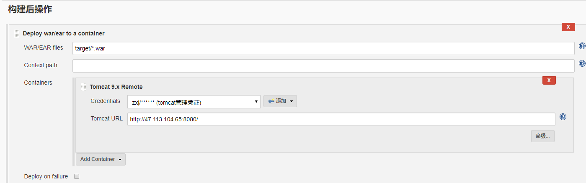

### 7.2 Maven项目构建

构建maven项目需要安装maven integration插件。在新建项目中选择构建maven类型的项目。maven类型的项目在拉取代码和部署上与自由风格项目一样，只是“构建”部分不同。自由风格的构建可以使用shell脚本，maven项目构建是读取pom.xml文件。

1. 拉取代码

   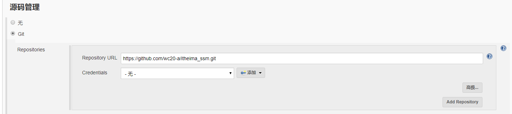

2. 编译构建

   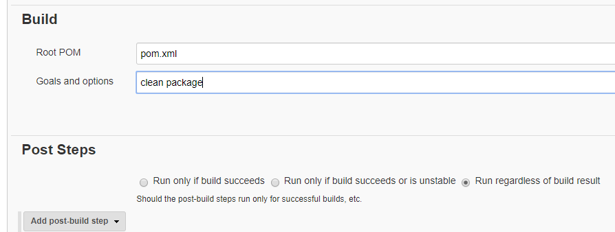

   Root POM是存放pom文件的路径

   Goals and options里写要执行的mvn指令，不需要再加mvn了。

3. 部署

   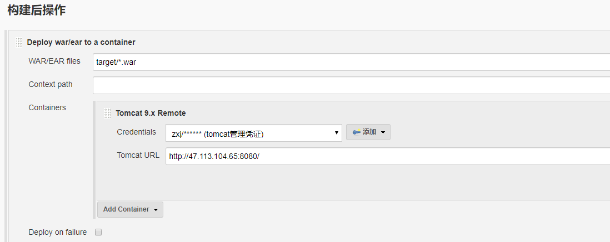


### 7.3 流水线项目构建（*）

**pipeline简介**

pipeline，简单来说就是一套运行在Jenkins上的工作流框架，将原来独立运行于单个或多个节点的任务连接起来，实现单个任务难以完成的复杂流程编排和可视化的工作。


**使用pipeline的好处**

代码：pipeline以代码的形式实现，通常被检入源代码控制，使团队能够编辑，审查和迭代其传送流程。

持久：无论是计划内的还是计划外的服务器重启，pipeline都是可以恢复的。

可停止：pipeline可以交互式输入，以确定是否继续执行pipeline。

多功能：pipeline支持现实世界中复杂的持续交付需求，它支持fork/join，循环执行，并行执行任务的功能。

可扩展：pipeline插件支持其DSL的自定义扩展，以及与其他插件集成的多个选项。


**如何创建jenkins pipeline**

* pipeline脚本使用Groovy语言实现。
* pipeline支持两种语法：Declarative（声明式）和Scripted pipeline（脚本式）语法。
* pipeline也有两种创建方法：可以直接在Jenkins的wen ui界面输入脚本；也可以通过创建一个Jenkins脚本文件放到项目文件源码库中（一般推荐在Jenkins中直接从源码控制中直接载入Jenkinsfile pipeline这种方法）。


流水线项目与前面两个项目最大的区别在于多了流水线脚本定义，取代了原先的构建及构建后操作。将原先的拉取代码，编译构建，部署都集成在流水线中来完成。

声明式语法创建流水线项目

```groovy
pipeline {
   agent any//环境和工具

   stages {//一般只有一个，里面包含多个stage
      stage('Hello') {//阶段，对应拉取代码，编译打包，部署等步骤
         steps {//步骤
            echo 'Hello World'
         }
      }
   }
}
```

声明式语法主要包括两大块，stages前面的语句块和stages语句块。stages前面的语句可以写代理（dockers环境maven工具等）。stages表示阶段，包括拉取代码，编译构建，部署等操作在不同的阶段完成。

实例：

```groovy
pipeline {
   agent any

   stages {
      stage('pull code') {
         steps {
            echo 'pull code'
         }
      }
      stage('build project') {
         steps {
            echo 'build project'
         }
      }
      stage('publish project') {
         steps {
            echo 'publish project'
         }
      }
   }
}
```

脚本式语法创建流水线项目

```groovy
node {
   def mvnHome
   stage('pull code') { // for display purposes
      echo 'pull code'
   }
   stage('Build project') {
      echo 'Build project'
   }
   stage('publish project') {
      echo 'publish project'
   }
}
```

使用流水线语法可以帮助我们生成pipeline脚本片段。

1. 通过git拉取代码

   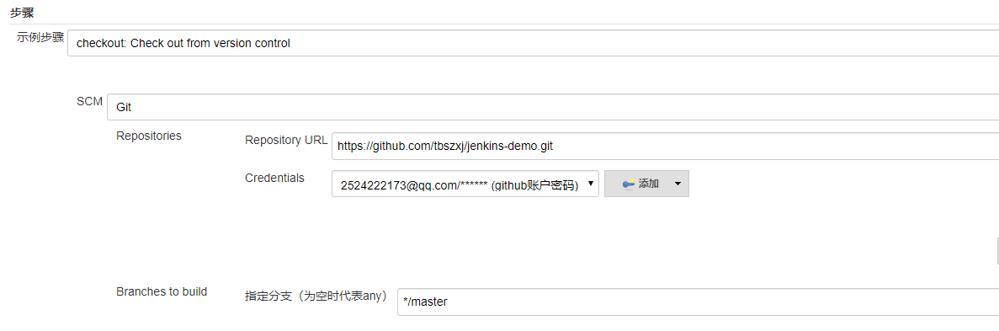

   ```groovy
   checkout([$class: 'GitSCM', branches: [[name: '*/master']], doGenerateSubmoduleConfigurations: false, extensions: [], submoduleCfg: [], userRemoteConfigs: [[credentialsId: 'bb0d0f65-be2f-461d-bdaf-361fc162c099', url: 'https://github.com/tbszxj/jenkins-demo.git']]])
   ```

2. 编译打包

   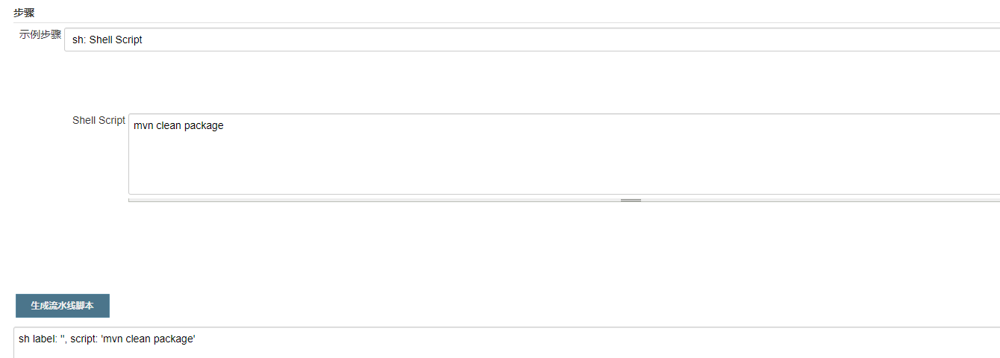

   ```groovy
   sh label: '', script: 'mvn clean package'
   ```

3. 远程部署

   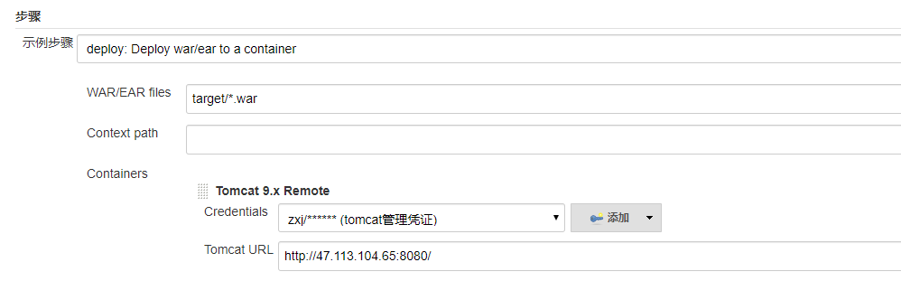

   ```groovy
   deploy adapters: [tomcat9(credentialsId: '8f8cc6c9-3ce8-42d6-9b99-ddf987be0aac', path: '', url: 'http://47.113.104.65:8080/')], contextPath: null, war: 'target/*.war'
   ```

完整的声明式脚本：

```groovy
pipeline {
   agent any

   stages {
      stage('pull code') {
         steps {
            checkout([$class: 'GitSCM', branches: [[name: '*/master']], doGenerateSubmoduleConfigurations: false, extensions: [], submoduleCfg: [], userRemoteConfigs: [[credentialsId: 'bb0d0f65-be2f-461d-bdaf-361fc162c099', url: 'https://github.com/tbszxj/jenkins-demo.git']]])
         }
      }
      stage('build project') {
         steps {
            sh label: '', script: 'mvn clean package'
         }
      }
      stage('publish project') {
         steps {
            deploy adapters: [tomcat9(credentialsId: '8f8cc6c9-3ce8-42d6-9b99-ddf987be0aac', path: '', url: 'http://47.113.104.65:8080/')], contextPath: null, war: 'target/*.war'
         }
      }
   }
}
```


**从项目中获取jenkins脚本**

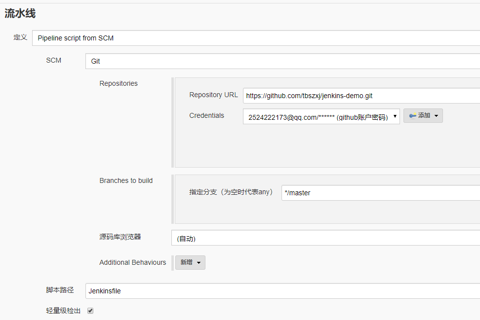


## 八、常见的触发器

Jenkins内置四种构建触发器

* 触发远程构建
* 其他工程构建后触发（build after other projects are build）
* 定时构建（build periodically）
* 轮询SCM（poll scm）

1. 触发远程构建

   在构建触发器中选中构建触发，使用对应的url+token来触发远程构建

   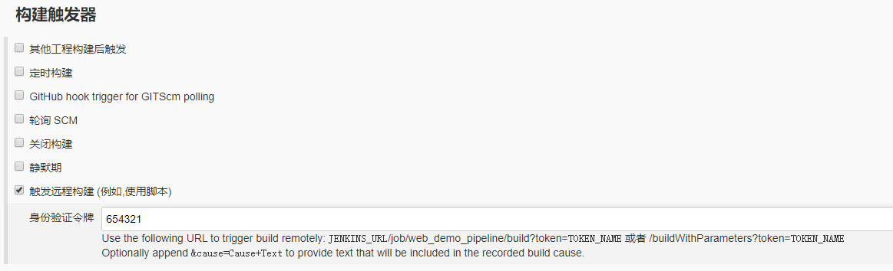

```
该例中使用下面的ur触发远程构建
http://47.113.104.65:9090/job/web_demo_pipeline/build?token=654321
```

2. 其他工程构建后触发

   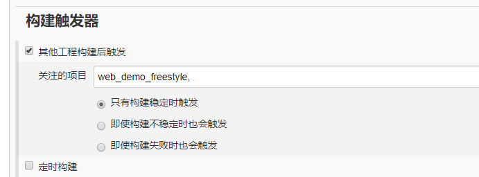

3. 定时构建

   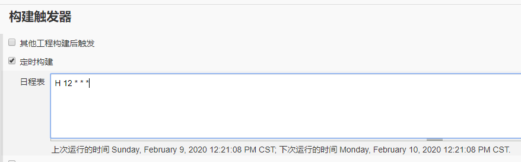

   定时构建与轮询SCM都需要用到时间，了解Jenkins的定时规则。

   定时字符串从左到右分别为：分 时 日 月 周

   例如：

   >每30分钟构建一次：H代表形参
   >
   >H/30 * * * * 10:02    10:32
   >
   >
   >
   >每两个小时构建一次
   >
   >H H/2 * * *
   >
   >
   >
   >每天的8点，12点，22点构建三次
   >
   >0 8,12,22 * * *
   >
   >
   >
   >每天中午12点构建一次
   >
   >H 12 * * *

4. 轮询SCM

   轮询SCM，是指定扫描本地代码仓库的代码是否有变更，如果有就触发项目构建

   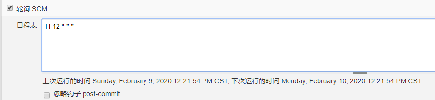

   注意：这次构建触发器，Jenkins会定时扫描本地整个项目的代码，增大系统的开销不建议使用。

5. webhook钩子

   Jenkins内置的触发器中，SCM轮询可以实现代码仓库变更项目自动构建的，但是该方案定时轮询性能不佳。一种更好的方案是利用GitLab或GitHub的webhook实现代码push到仓库，立即触发构建。（这种方式在经常提交的项目中不同适用）

   轮询SCM原理

   ```mermaid
   graph LR
   A[Jenkins] -->|发送定时请求| B[GitLab代码变更]
   ```

   webhook原理示意图

   ```mermaid
   graph LR
   C[GitLab代码变更] -->|发送构建请求| D[Jenkins]
   ```

在github的代码仓库的settings中设置Webhooks，填写正确的参数。并在Jenkins安全配置中允许接受外部webhooks请求。

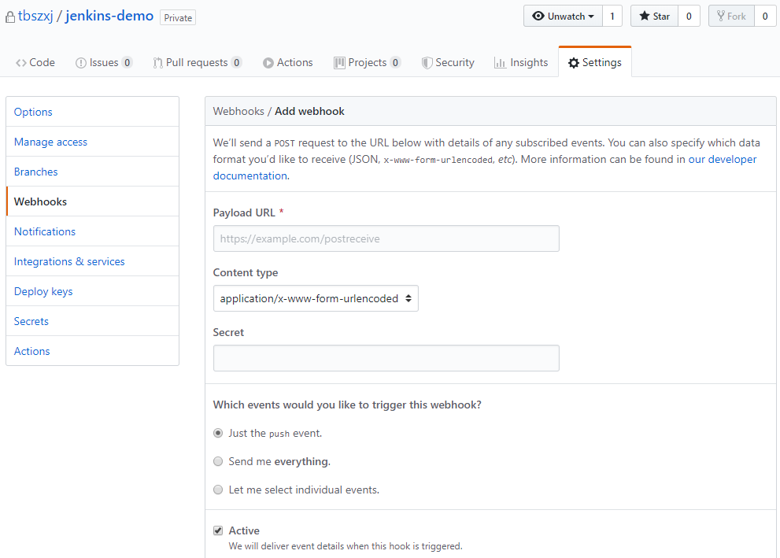

## 九、整合其他服务

1. 整合邮件服务

   先安装Email Extension Template插件，以便后面使用html邮件模板。

   修改系统管理员邮箱为发件的邮箱地址

   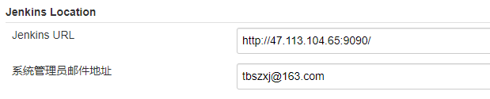

   配置扩展邮件通知

   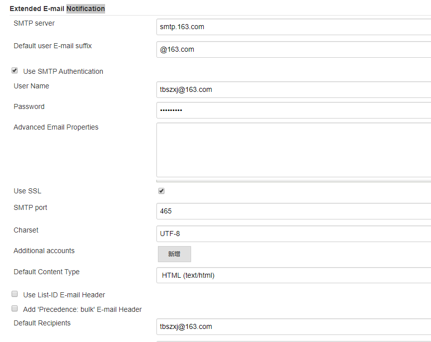

   配置邮件通知

   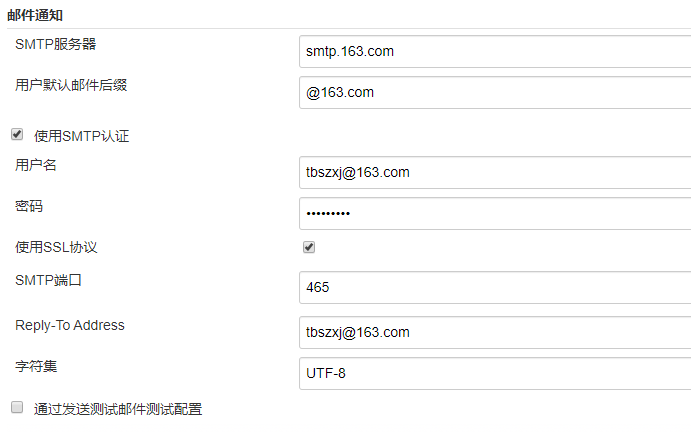

   在仓库中新增html邮件通知模板，并修改构建脚本。

   核心代码生成

   

   ```
   post {
   	always {
   		emailext {
   			subject:'构建通知:${PROJECT_NAME} Build # ${BUILD_NUMBER} ${BUILD_STATUS}',
   			body: '${FILE,path="emailMsgTemplate.html"}',
   			to:'2524222173@qq.com'
   		}
   	}
   }
   ```

   

2. 整合SonarQube代码审查功能

   先安装插件SonarQube Scanner

   ```mermaid
   graph LR
   jenkins -->|调用| Sonar-Scanner -->|提交审核结果| SonarQube -->|保存审核结果| Mysql
   ```

   自动安装SonarQube Scanner

   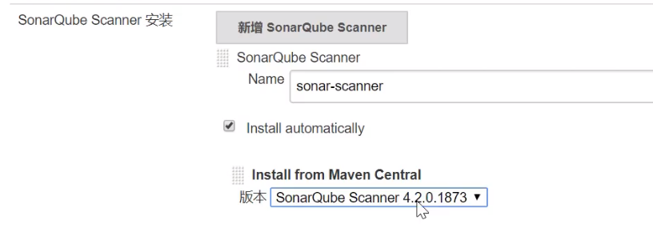

在系统设置中配置SonarQube服务器信息

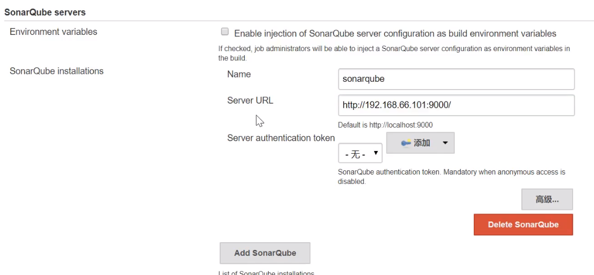

流水线项目可以在拉取代码步骤之后新增步骤

```groovy
stage('code checking'){
    steps{
        script{
            //引入SonarQubeScanner工具，名字就是配置的工具名字
            scannerHome = tool 'sonar-sacnner'
        }
        //引入配置的SonarQube服务器环境
        withSonarQubeEnv('sonarqube'){
            sh "${scannerHome}/bin/sonar-scanner"
        }
    }
}
```

