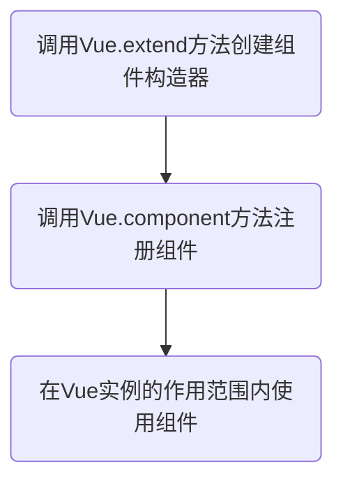
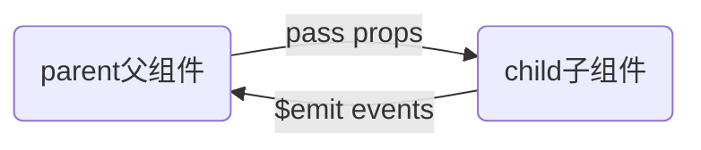

# Vue学习笔记

## 一、Vue基本语法

### 1.1 vue概念部分

**vue的生命周期**


生命周期钩子函数简介

| 方法名        | 描述                                                         |
| ------------- | ------------------------------------------------------------ |
| beforeCreate  | 在实例初始化之后，数据观测 (data observer) 和 event/watcher 事件配置之前被调用 |
| created       | 在实例创建完成后被立即调用。在这一步，实例已完成以下的配置：数据观测 (data observer)，属性和方法的运算，watch/event 事件回调。然而，挂载阶段还没开始，$el 属性目前尚不可用。 |
| beforeMount   | 在挂载开始之前被调用：相关的 render 函数首次被调用。         |
| mounted       | 实例被挂载后调用，这时 el 被新创建的 vm.$el 替换了。 如果根实例挂载到了一个文档内的元素上，当mounted被调用时vm.$el也在文档内。 |
| beforeUpdate  | 数据更新时调用，发生在虚拟 DOM 打补丁之前。这里适合在更新之前访问现有的 DOM，比如手动移除已添加的事件监听器。 |
| updated       | 由于数据更改导致的虚拟 DOM 重新渲染和打补丁，在这之后会调用该钩子。<br>当这个钩子被调用时，组件 DOM 已经更新，所以你现在可以执行依赖于 DOM 的操作。然而在大多数情况下，你应该避免在此期间更改状态。如果要相应状态改变，通常最好使用计算属性或 watcher 取而代之。 |
| activated     | 被 keep-alive 缓存的组件激活时调用                           |
| deactivated   | 被 keep-alive 缓存的组件停用时调用。                         |
| beforeDestory | 实例销毁之前调用。在这一步，实例仍然完全可用                 |
| destoryed     | 实例销毁后调用。该钩子被调用后，对应 Vue 实例的所有指令都被解绑，所有的事件监听器被移除，所有的子实例也都被销毁。 |
| errorCaptured | 2.5.0+新增<br>当捕获一个来自子孙组件的错误时被调用。此钩子会收到三个参数：错误对象、发生错误的组件实例以及一个包含错误来源信息的字符串。此钩子可以返回 false 以阻止该错误继续向上传播。 |

**vue中的MVVM**


### 1.2 创建vue实例

创建Vue实例的时候传入了一些options：{}

* el属性：该属性决定了这个Vue对象挂载到哪一个元素上
* data属性：该属性中通常会存储一些数据，这些数据可以是直接定义出来的，也可以是来从服务器获取的
* method属性：定义属于Vue的一些方法，可以在其他地方调用，也可以在指令中使用

```html
<script>
    //es6中使用let定义变量/const定义常量
    const app = new Vue({
        el: '#app',//用于挂载要管理的元素
        data: { //定义数据
            message: 'hello Vue!'
        }
    })
</script>
```

**Mustache语法**

vue将data中的文本数据插入到HTML中使用的是Mustache语法（也就是双大括号），Mustache 主要用于在表现和数据相分离的前端技术架构中，根据数据生成特定的动态内容。

注意：Mustache语法是在content中才能使用，在属性值中不能使用，属性值动态插入应使用v-bind指令

```html
<div id="app">
    <h2>{{message}}</h2>
    <h2>{{message}} , 你好世界！</h2>
    <!--Mustache语法中，不仅仅可以直接写变量，也可以写简单的表达式-->
    <h2>{{firstName + ' ' + lastName}}</h2>
</div>
```

### 1.3 常用vue指令

1. **v-bind指令**

   - **缩写**：`:`

   - **预期**：`any (with argument) | Object (without argument)`

   - **参数**：`attrOrProp (optional)`

   - **修饰符**：

     - `.prop` - 作为一个 DOM property 绑定而不是作为 attribute 绑定。([差别在哪里？](https://stackoverflow.com/questions/6003819/properties-and-attributes-in-html#answer-6004028))
     - `.camel` - (2.1.0+) 将 kebab-case 特性名转换为 camelCase. (从 2.1.0 开始支持)
     - `.sync` (2.3.0+) 语法糖，会扩展成一个更新父组件绑定值的 `v-on` 侦听器。

   - **用法**：

     动态地绑定一个或多个特性，或一个组件 prop 到表达式。

     在绑定 `class` 或 `style` 特性时，支持其它类型的值，如数组或对象。可以通过下面的教程链接查看详情。

     在绑定 prop 时，prop 必须在子组件中声明。可以用修饰符指定不同的绑定类型。

     没有参数时，可以绑定到一个包含键值对的对象。注意此时 `class` 和 `style` 绑定不支持数组和对象。

   ```html
   <div id="app">
     
   </div>
   <script src="../js/vue.js"></script>
   <script>
     const app = new Vue({
       el: '#app',
       data: {
         message: 'hello world!',
         imageUrl: 'https://ss0.bdstatic.com/70cFuHSh_Q1YnxGkpoWK1HF6hhy/it/u=1906469856,4113625838&fm=26&gp=0.jpg'
       }
     })
   </script>
   ```


   **更多的关于vue的指令介绍参考官网的教程**

   [https://cn.vuejs.org/v2/api/#%E6%8C%87%E4%BB%A4](https://cn.vuejs.org/v2/api/#指令)

## 二、组件化开发

### 2.1 组件化的基本使用

组件的使用分为三个步骤：



1. 创建组件构造器

   ```javascript
   const cpnC = Vue.extend({
       template:`<div>
       <h2>我是组件标题</h2>
       <p>我是组件内容1</p>
       <p>我是组件内容2</p>
     </div>`
     });
   ```

2. 注册组件

   ```javascript
   Vue.component('my-cpn',cpnC);
   ```

3. 使用组件

   ```html
   <div id="app">
     <my-cpn></my-cpn>
   </div>
   ```

### 2.2 全局组件和局部组件

1. 使用Vue.component方法注册全局组件

   ```javascript
   Vue.component('my-cpn',cpnC);
   ```

2. 使用Vue实例的component方法注册局部主键

   ```javascript
   components: {
     //注册局部组件，前面是标签名，后面是组件构造器
     cpn: cpnC
   }
   ```

### 2.3父组件和子组件

在一个组件的构造器中component方法中注册另一个组件，被注册的组件就成为了该组件的子组件，可以在该组件的template中使用

```javascript
//1.创建第一个组件构造器
  const cpn1 = Vue.extend({
    template:`<div>
      <h2>我是组件1标题</h2>
      <p>我是组件1内容</p>
    </div>`
  });
  //2.创建第二个组件构造器
  const cpn2 = Vue.extend({
    template:`<div>
      <h2>我是组件2标题</h2>
      <p>我是组件2内容</p>
      <cpn1></cpn1>
    </div>`,
    components: {
      //在一个组件中注册另一个组件
      //被注册的组件即成为该组件的子组件
      //可以在该组件的template中使用
      cpn1: cpn1
    }
  });
```

### 2.4 父子组件间通信

父组件向子组件传递信息通过props，子组件向父组件传递信息需要通过自定义事件



1. 父传子通过props

   定义子组件，在props属性中定义需要从父组件传过来的属性

   ```html
   <template id="cpn">
     <div>
       <h2>{{cmessage}}</h2>
       <ul>
         <li v-for="item in cmovies">{{item}}</li>
       </ul>
     </div>
   </template>
   ```

   ```javascript
   const cpn = {
       template: '#cpn',
       props: {
         cmessage: {
           type: String,//设置类型
           default: 'aaa',//设置默认值
           required: true//设置改属性是否必传
         },
         cmovies: {
           //类型是array或对象时传递的默认值必须是一个函数
           type: Array,
           default(){
             return []
           },
           required: true
         }
       }
     };
   ```

   定义父组件

   ```javascript
   const app = new Vue({
       el: '#app',
       data: {
         message: 'hello world!',
         movies: ['海王','葫芦娃','小虾米']
       },
       components: {
         cpn
       }
     })
   ```

   数据传递，将父组件定义的数据赋值给子组件props属性中定义的属性

   ```html
   <div id="app">
     <cpn :cmovies="movies" :cmessage="message"></cpn>
   </div>
   ```

2. 子传父通过自定义事件

   定义子组件

   ```html
   <template id="cpn">
     <div>
       <button v-for="item in categories" @click="btnClick(item)">{{item.name}}</button>
     </div>
   </template>
   ```

   ```javascript
   const cpn = {
       template: '#cpn',
       data(){
         return {
           categories:[
             {id:'aaa',name:'热门推荐'},
             {id:'bbb',name:'数码办公'},
             {id:'ccc',name:'生活用品'},
             {id:'ddd',name:'家用电器'}
           ]
         }
       },
       methods: {
         btnClick(item){
           //向父组件发送事件
           this.$emit('item-click',item);
         }
       }
     };
   ```

   定义父组件

   ```javascript
   const app = new Vue({
       el: '#app',
       methods: {
         handleClick(item){
           console.log(item);
         }
       },
       components: {
         cpn
       }
     })
   ```

   子组件通过事件向父组件传递信息

   ```html
   <div id="app">
     <!--父组件监听子组件的自定义事件来处理-->
     <cpn @item-click="handleClick"></cpn>
   </div>
   ```

## 三、Vue CLI详解


## 四、vue-router路由相关


## 五、Vuex详解


## 六、网络封装


