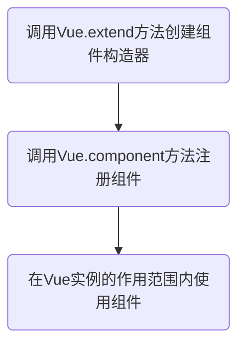
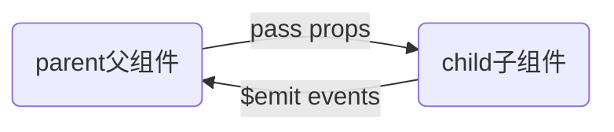

# Vue学习笔记

## 一、Vue基本语法

### 1.1 vue概念部分

**vue的生命周期**


生命周期钩子函数简介

| 方法名        | 描述                                                         |
| ------------- | ------------------------------------------------------------ |
| beforeCreate  | 在实例初始化之后，数据观测 (data observer) 和 event/watcher 事件配置之前被调用 |
| created       | 在实例创建完成后被立即调用。在这一步，实例已完成以下的配置：数据观测 (data observer)，属性和方法的运算，watch/event 事件回调。然而，挂载阶段还没开始，$el 属性目前尚不可用。 |
| beforeMount   | 在挂载开始之前被调用：相关的 render 函数首次被调用。         |
| mounted       | 实例被挂载后调用，这时 el 被新创建的 vm.$el 替换了。 如果根实例挂载到了一个文档内的元素上，当mounted被调用时vm.$el也在文档内。 |
| beforeUpdate  | 数据更新时调用，发生在虚拟 DOM 打补丁之前。这里适合在更新之前访问现有的 DOM，比如手动移除已添加的事件监听器。 |
| updated       | 由于数据更改导致的虚拟 DOM 重新渲染和打补丁，在这之后会调用该钩子。<br>当这个钩子被调用时，组件 DOM 已经更新，所以你现在可以执行依赖于 DOM 的操作。然而在大多数情况下，你应该避免在此期间更改状态。如果要相应状态改变，通常最好使用计算属性或 watcher 取而代之。 |
| activated     | 被 keep-alive 缓存的组件激活时调用                           |
| deactivated   | 被 keep-alive 缓存的组件停用时调用。                         |
| beforeDestory | 实例销毁之前调用。在这一步，实例仍然完全可用                 |
| destoryed     | 实例销毁后调用。该钩子被调用后，对应 Vue 实例的所有指令都被解绑，所有的事件监听器被移除，所有的子实例也都被销毁。 |
| errorCaptured | 2.5.0+新增<br>当捕获一个来自子孙组件的错误时被调用。此钩子会收到三个参数：错误对象、发生错误的组件实例以及一个包含错误来源信息的字符串。此钩子可以返回 false 以阻止该错误继续向上传播。 |

**vue中的MVVM**


### 1.2 创建vue实例

创建Vue实例的时候传入了一些options：{}

* el属性：该属性决定了这个Vue对象挂载到哪一个元素上
* data属性：该属性中通常会存储一些数据，这些数据可以是直接定义出来的，也可以是来从服务器获取的
* method属性：定义属于Vue的一些方法，可以在其他地方调用，也可以在指令中使用

```html
<script>
    //es6中使用let定义变量/const定义常量
    const app = new Vue({
        el: '#app',//用于挂载要管理的元素
        data: { //定义数据
            message: 'hello Vue!'
        }
    })
</script>
```

**Mustache语法**

vue将data中的文本数据插入到HTML中使用的是Mustache语法（也就是双大括号），Mustache 主要用于在表现和数据相分离的前端技术架构中，根据数据生成特定的动态内容。

注意：Mustache语法是在content中才能使用，在属性值中不能使用，属性值动态插入应使用v-bind指令

```html
<div id="app">
    <h2>{{message}}</h2>
    <h2>{{message}} , 你好世界！</h2>
    <!--Mustache语法中，不仅仅可以直接写变量，也可以写简单的表达式-->
    <h2>{{firstName + ' ' + lastName}}</h2>
</div>
```

### 1.3 常用vue指令

1. **v-bind指令**

   - **缩写**：`:`

   - **预期**：`any (with argument) | Object (without argument)`

   - **参数**：`attrOrProp (optional)`

   - **修饰符**：

     - `.prop` - 作为一个 DOM property 绑定而不是作为 attribute 绑定。([差别在哪里？](https://stackoverflow.com/questions/6003819/properties-and-attributes-in-html#answer-6004028))
     - `.camel` - (2.1.0+) 将 kebab-case 特性名转换为 camelCase. (从 2.1.0 开始支持)
     - `.sync` (2.3.0+) 语法糖，会扩展成一个更新父组件绑定值的 `v-on` 侦听器。

   - **用法**：

     动态地绑定一个或多个特性，或一个组件 prop 到表达式。

     在绑定 `class` 或 `style` 特性时，支持其它类型的值，如数组或对象。可以通过下面的教程链接查看详情。

     在绑定 prop 时，prop 必须在子组件中声明。可以用修饰符指定不同的绑定类型。

     没有参数时，可以绑定到一个包含键值对的对象。注意此时 `class` 和 `style` 绑定不支持数组和对象。

   ```html
   <div id="app">
     
   </div>
   <script src="../js/vue.js"></script>
   <script>
     const app = new Vue({
       el: '#app',
       data: {
         message: 'hello world!',
         imageUrl: 'https://ss0.bdstatic.com/70cFuHSh_Q1YnxGkpoWK1HF6hhy/it/u=1906469856,4113625838&fm=26&gp=0.jpg'
       }
     })
   </script>
   ```


   **更多的关于vue的指令介绍参考官网的教程**

   [https://cn.vuejs.org/v2/api/#%E6%8C%87%E4%BB%A4](https://cn.vuejs.org/v2/api/#指令)

## 二、组件化开发

### 2.1 组件化的基本使用

组件的使用分为三个步骤：



1. 创建组件构造器

   ```javascript
   const cpnC = Vue.extend({
       template:`<div>
       <h2>我是组件标题</h2>
       <p>我是组件内容1</p>
       <p>我是组件内容2</p>
     </div>`
     });
   ```

2. 注册组件

   ```javascript
   Vue.component('my-cpn',cpnC);
   ```

3. 使用组件

   ```html
   <div id="app">
     <my-cpn></my-cpn>
   </div>
   ```

### 2.2 全局组件和局部组件

1. 使用Vue.component方法注册全局组件

   ```javascript
   Vue.component('my-cpn',cpnC);
   ```

2. 使用Vue实例的component方法注册局部主键

   ```javascript
   components: {
     //注册局部组件，前面是标签名，后面是组件构造器
     cpn: cpnC
   }
   ```

### 2.3父组件和子组件

在一个组件的构造器中component方法中注册另一个组件，被注册的组件就成为了该组件的子组件，可以在该组件的template中使用

```javascript
//1.创建第一个组件构造器
  const cpn1 = Vue.extend({
    template:`<div>
      <h2>我是组件1标题</h2>
      <p>我是组件1内容</p>
    </div>`
  });
  //2.创建第二个组件构造器
  const cpn2 = Vue.extend({
    template:`<div>
      <h2>我是组件2标题</h2>
      <p>我是组件2内容</p>
      <cpn1></cpn1>
    </div>`,
    components: {
      //在一个组件中注册另一个组件
      //被注册的组件即成为该组件的子组件
      //可以在该组件的template中使用
      cpn1: cpn1
    }
  });
```

### 2.4 父子组件间通信

父组件向子组件传递信息通过props，子组件向父组件传递信息需要通过自定义事件



1. 父传子通过props

   定义子组件，在props属性中定义需要从父组件传过来的属性

   ```html
   <template id="cpn">
     <div>
       <h2>{{cmessage}}</h2>
       <ul>
         <li v-for="item in cmovies">{{item}}</li>
       </ul>
     </div>
   </template>
   ```

   ```javascript
   const cpn = {
       template: '#cpn',
       props: {
         cmessage: {
           type: String,//设置类型
           default: 'aaa',//设置默认值
           required: true//设置改属性是否必传
         },
         cmovies: {
           //类型是array或对象时传递的默认值必须是一个函数
           type: Array,
           default(){
             return []
           },
           required: true
         }
       }
     };
   ```

   定义父组件

   ```javascript
   const app = new Vue({
       el: '#app',
       data: {
         message: 'hello world!',
         movies: ['海王','葫芦娃','小虾米']
       },
       components: {
         cpn
       }
     })
   ```

   数据传递，将父组件定义的数据赋值给子组件props属性中定义的属性

   ```html
   <div id="app">
     <cpn :cmovies="movies" :cmessage="message"></cpn>
   </div>
   ```

2. 子传父通过自定义事件

   定义子组件

   ```html
   <template id="cpn">
     <div>
       <button v-for="item in categories" @click="btnClick(item)">{{item.name}}</button>
     </div>
   </template>
   ```

   ```javascript
   const cpn = {
       template: '#cpn',
       data(){
         return {
           categories:[
             {id:'aaa',name:'热门推荐'},
             {id:'bbb',name:'数码办公'},
             {id:'ccc',name:'生活用品'},
             {id:'ddd',name:'家用电器'}
           ]
         }
       },
       methods: {
         btnClick(item){
           //向父组件发送事件
           this.$emit('item-click',item);
         }
       }
     };
   ```

   定义父组件

   ```javascript
   const app = new Vue({
       el: '#app',
       methods: {
         handleClick(item){
           console.log(item);
         }
       },
       components: {
         cpn
       }
     })
   ```

   子组件通过事件向父组件传递信息

   ```html
   <div id="app">
     <!--父组件监听子组件的自定义事件来处理-->
     <cpn @item-click="handleClick"></cpn>
   </div>
   ```

### 2.5 父子组件访问

父组件访问子组件

1. 通过$children的方式

   ```html
   <!--子组件的使用-->
   <div id="app">
     <cpn></cpn>
     <cpn></cpn>
     <cpn></cpn>
     <button @click="btnClick">按钮</button>
   </div>
   ```

   ```html
   <!--子组件模板-->
   <template id="cpn">
     <h2>我是子组件</h2>
   </template>
   ```

   ```javascript
   //父子组件的定义
   const app = new Vue({
       el: '#app',
       data: {
         message: 'hello world!'
       },
       methods: {
         btnClick(){
           //children方式通常时获取所有子组件时使用
           console.log(this.$children);
           this.$children[0].showMessage();
           console.log(this.$children[0].name);
         }
       },
       components: {
         cpn: {
           template: '#cpn',
           data(){
             return {
               name : '子组件名字'
             }
           },
           methods: {
             showMessage (){
               console.log("子组件显示");
             }
           }
         }
       }
     })
   ```

2. 通过$refs的方式

   ```html
   <!--子组件的使用,加上ref标签-->
   <div id="app">
     <cpn ref="first"></cpn>
     <cpn></cpn>
     <cpn></cpn>
     <button @click="btnClick">按钮</button>
   </div>
   ```

   ```html
   <template id="cpn">
     <h2>我是子组件</h2>
   </template>
   ```

   ```javascript
   const app = new Vue({
       el: '#app',
       data: {
         message: 'hello world!'
       },
       methods: {
         btnClick(){
           //refs方式时候获取某个子组件时
           console.log(this.$refs);
           console.log(this.$refs.first.name);
         }
       },
       components: {
         cpn: {
           template: '#cpn',
           data(){
             return {
               name : '子组件名字'
             }
           },
           methods: {
             showMessage (){
               console.log("子组件显示");
             }
           }
         }
       }
     })
   ```

子组件访问父组件和根组件

```html
<!--根组件中使用子组件-->
<div id="app">
  <cpn></cpn>
</div>
```

```html
<!--子组件定义-->
<template id="cpn">
  <ccpn></ccpn>
</template>
<!--子组件中的子组件-->
<template id="ccpn">
  <div>
    <h2>我是子组件</h2>
    <button @click="btnClick">按钮</button>
  </div>
</template>
```

```javascript
const app = new Vue({
    el: '#app',
    data: {
      message: 'hello world!'
    },
    components: {
      cpn: {
        template: '#cpn',
        components: {
          ccpn: {
            template: '#ccpn',
            methods: {
              btnClick(){
                //子组件访问父组件parent
                console.log(this.$parent);
                //子组件访问根组件
                console.log(this.$root);
              }
            }
          }
        }
      }
    }
  })
```

### 2.6 插槽的使用

插槽的使用主要是为了组件有更好的扩展性,有些组件可能结构类似但里面的东西略有不同,每个组件单独封装有些冗余,封装成一个又无法通用,此时就可以预留插槽,保留结构共性,使用内容的不同.

1. 基本使用

   ```html
   <div id="app">
     <cpn><button>按钮</button></cpn>
     <cpn><span>哈哈哈</span></cpn>
     <cpn><i>呵呵呵</i></cpn>
     <cpn></cpn>
   </div>
   ```

   ```html
   <template id="cpn">
     <div>
       <h2>我是组件</h2>
       <p>我是组件内容</p>
       <!--可以给插槽赋一个默认值，如果没有传显示默认值-->
       <slot><button>按钮</button></slot>
     </div>
   </template>
   ```

   ```javascript
   const app = new Vue({
       el: '#app',
       data: {
         message: 'hello world!'
       },
       components: {
         cpn: {
           template: '#cpn'
         }
       }
     })
   ```

2. 具名插槽

   ```html
   <div id="app">
     <cpn><span slot="center">标题</span></cpn>
   </div>
   ```

   ```html
   <template id="cpn">
     <div>
       <slot name="left">左边</slot>
       <slot name="center">中间</slot>
       <slot name="right">右边</slot>
     </div>
   </template>
   ```

   js中组件定义同上

3. 作用域插槽

   ```html
   <div id="app">
     <cpn></cpn>
     <cpn>
       <!--目的是获取子组件中的pLanguages-->
       <template slot-scope="slot">
         <!--<span v-for="item in slot.data">{{item}} -&#45;&#45; </span>-->
         <span>{{slot.data.join('  ---  ')}}</span>
       </template>
     </cpn>
     <cpn>
       <template slot-scope="slot">
       <!--<span v-for="item in slot.data">{{item}} *** </span>-->
         <span>{{slot.data.join('  ***  ')}}</span>
       </template>
     </cpn>
   </div>
   ```

   ```html
   <template id="cpn">
     <div>
       <slot :data="pLanguages">
         <ul>
           <li v-for="item in pLanguages">{{item}}</li>
         </ul>
       </slot>
     </div>
   </template>
   ```

   ```javascript
   const app = new Vue({
       el: '#app',
       data: {
         message: 'hello world!',
         isShow: true
       },
       components: {
         cpn: {
           template: '#cpn',
           data(){
             return {
               pLanguages: ['java','javaScript','css','C++']
             }
           }
         }
       }
     })
   ```

## 三、Vue CLI详解

### 3.1 脚手架的基本使用

1. 安装脚手架

   ```powershell
   #全局安装脚手架3
   npm install -g @vue/cli
   #如果在脚手架三的基础上希望使用脚手架2还需要再安装
   #vue init的运行效果跟vue-cli@2.x的效果相同
   npm install -g @vue/cli-init
   ```

2. 创建项目

   ```powershell
   #脚手架2创建项目
   vue init webpack my-project
   #脚手架3创建项目
   vue create my-project
   ```

### 3.2 runtime-only和runtime+compiler的区别

两者的区别主要在于main.js中,在程序运行的流程中流程中，

rc模式：template-->ast-->render-->vdom-->ui

ro模式：render-->vdom-->ui

| runtime-only                                                 | runtime+compiler                                             |
| ------------------------------------------------------------ | ------------------------------------------------------------ |
| import Vue from 'vue'<br/>import App from './App'<br/><br/>Vue.config.productionTip = false<br/><br/>/* eslint-disable no-new */<br/>new Vue({<br/>  el: '#app',<br/>  render: h => h(App)<br/>}) | import Vue from 'vue'<br/>import App from './App'<br/><br/>Vue.config.productionTip = false<br/><br/>/* eslint-disable no-new */<br/>new Vue({<br/>  el: '#app',<br/>  components: { App },<br/>  template: '<App/>'<br/>}) |

**VueCLI3配置文件的查看和修改**

在VueCLI3中查看和修改配置文件的三种方式

**查看**

1. 启动配置服务器：vue ui，导入项目在配置中查看
2. node安装的vue包中config目录下查看相关配置信息

**修改**

在项目根目录下创建vue.config.js文件对vue进行相关配置,通过module导出，打包时脚手架会将这个配置文件和vue中的配置文件进行合并

```javascript
module.exports = {
  
}
```

## 四、vue-router路由相关

### 4.1 路由基本概念

**前端路由和后端路由**

路由分前端路由和后端路由，传统的使用JSP进行动态页面开发的网站属于后端路由，每一个url请求会返回一个渲染后的html文件，浏览器将html进行渲染展示。

前端路由是在前后端分离后针对SPA应用的，单页面应用在初次加载时完成所有静态资源的加载，根据前端路由来在不同的时候展示不同的页面。

**URL的hash和浏览器的history**

URL的hasn也就是锚点（#），本质上是改变window.location的href属性，我们可以通过直接赋值location.hash来改变href，但页面不发生刷新

```javascript
location.hash = 'home'
//执行后对应的url：http://localhost:8080/#/home
```

通过history也可以做到改变页面不刷新页面的效果

```javascript
history.pushState({},{},'home')
//执行后对于的url：http://localhost:8080/home
history.replaceState({},{},'xxx')//replace和push的区别在于不保存记录，无法前进或返回
```

### 4.2 vue-router基本使用

1. 安装vue-router

   ```powershell
   npm install vue-router --save
   ```

2. 在模块化工程中使用它

   ```
   1. 导入路由对象，并调用Vue.use(VueRouter)
   2. 创建路由实例，并且传入路由映射配置
   3. 在Vue的实例中挂载创建的路由实例
   ```

3. 设置默认展示组件

   ```javascript
   //配置一个路由/，重定向到默认展示的组件路径
   {
       path:'/',
       redirect: '/home'
   }
   ```

4. 使用history模式进行路由切换

   ```javascript
   //创建路由的时候增加模式属性
   export default new Router({
     //配置路由和组件之间的关系
     routes: [...],
     mode:'history'
   })
   ```

**router-link标签补充**

* to: 设置路由path

* tag：设置要渲染成的标签，默认是<A>标签
* replace：不需要赋值，让路由不使用pushState，而是使用history的replaceState
* active-class：设置选中路由新增class名字（可以在创建路由对象时设置）

**通过代码进行路由跳转**

```javascript
//通过$router属性来进行跳转
this.$router.push('/home')
```

**动态路由**

在路径的配置时指定动态的参数，格式如下

```javascript
{
    path:'/user/:userId',
    name:'User',
    component:User
}
```

路由跳转的时候需要给动态的参数赋值

```html
<div id="app">
    <router-link to="/home">首页</router-link>
    <router-link to="/about">关于</router-link>
    <!--<router-link to="/user/zhangsan">用户</router-link>-->
    <router-link v-bind:to="'/user/'+userId">用户</router-link>
    <router-view/>
</div>
```

**路由的懒加载**

vue将不同的路由需要的js文件打包到单独的js文件中，请求某个路由只请求对于的js文件。js文件分包配置如下

将原先引入后直接使用的方式改为，请求时引入文件的方式

```javascript
//import Home from '@/components/Home'
//import About from '@/components/About'
//import User from '@/components/User'
const Home = () => import('../components/Home')
const About = () => import('../components/About')
const User = () => import('../components/User')
```

### 4.3 vue-router嵌套路由

嵌套路由的映射配置

```javascript
{
      path: '/home',
      name: 'Home',
      component: Home,
      children: [         
        {//设置默认打开路径
          path: '',
          redirect: 'news'
        },
        {//子路径
          path: 'news',
          component: HomeNews
        },
        {
          path: 'message',
          component: HomeMessage
        }
      ]
    },
```

嵌套路由home中的配置

```html
<template>
<div>
  <h2>我是首页</h2>
  <router-link to="/home/news">新闻</router-link>
  <router-link to="/home/message">消息</router-link>
  <router-view></router-view>
</div>
</template>
```

### 4.4 vue-router参数传递

参数的传递主要有两种方式

1. params

   * 配置路由格式：/router/:id

   * 传递的方式：在path后面跟上对应的值

   * 传递后形成的路径：/router/123，/router/abc

     ```html
     <router-link :to="'/user/'+userId">用户</router-link>
     ```

     ```html
     <h2>{{$route.params.userId}}</h2>
     ```

2. query

   * 配置路由格式：/router，也就是普通配置

   * 传递的方式：对象中使用query的key作为传递的方式

   * 传递后形成的路径：/router？id=123，/router？id=abc

     ```html
     <router-link :to="{path:'/profile',query:{name:'zxj',age:23}}">档案</router-link>
     ```

     ```html
     <p>{{$route.query.name}}</p>
     <p>{{$route.query.age}}</p>
     ```

**不直接通过router-link标签进行跳转**

```javascript
methods: {
    userClick(){
      this.$router.push('/user/'+this.userId)
    },
    profileClick(){
      this.$router.push({
        path: '/profile',
        query: {
          name: 'zxj',
          age: 24
        }
      })
    }
```

### 4.5 vue-router导航守卫

实现不同的页面展示不同的title

使用生命周期方法created在页面创建时修改title（需要每个文件单独写，太麻烦）

```javascript
<script>
  export default {
    name: "About",
    created() {
      document.title = '关于'
    }
  }
</script>
```

使用导航守卫

```javascript
//在路由配置信息中新增元信息
{
      path: '/about',
      name: 'About',
      component: About,
      meta: {
        title: '关于'
      }
    }
```

```javascript
//导航守卫
router.beforeEach((to,from,next) => {
  // 从from跳转到to
  document.title = to.matched[0].meta.title
  next()
})
```

### 4.6 keep-alive

keep-alive是vue内置的一个组件，可以使被包含的组件保留状态，或避免重新渲染

它有两个重要的属性

* include - 字符串或者正则表达，只有匹配的组件会被缓存
* exclude - 字符串或正则表达式，任何匹配的组件都不会被缓存

**router-view也是一个组件，如果直接被包在keep-alive里面，所有路径匹配到的视图组件都会被缓存**

路由可以配置keep-live ->一旦启用之后就可以使用activated/deactivated（活跃/不活跃）方法

### 4.7 $route和$router的区别

router为VueRouter的实例，相当于一个全局的路由器对象，里面含有很多属性和子对象，

例如history对象，经常用的跳转链接就可以用this.$router.push，和router-link跳转一样

this.$router.push会往history栈中添加一个新的记录

[详细见vue官方文档][https://router.vuejs.org/zh/guide/essentials/navigation.html]

## 五、Vuex详解


## 六、网络封装


