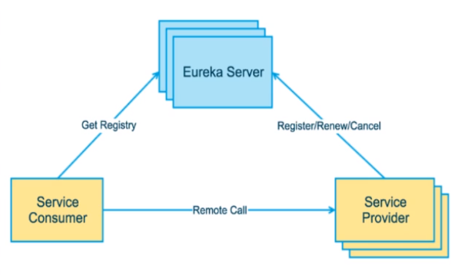

# Spring Cloud学习

## 一、Spring Cloud基本概念


## 二、项目构建

### 2.1 构建父工程

```xml
<?xml version="1.0" encoding="UTF-8"?>
<project xmlns="http://maven.apache.org/POM/4.0.0"
         xmlns:xsi="http://www.w3.org/2001/XMLSchema-instance"
         xsi:schemaLocation="http://maven.apache.org/POM/4.0.0 http://maven.apache.org/xsd/maven-4.0.0.xsd">
    <modelVersion>4.0.0</modelVersion>

    <groupId>org.tbszxj</groupId>
    <artifactId>cloud2020</artifactId>
    <version>1.0-SNAPSHOT</version>
    <packaging>pom</packaging>

    <properties>
        <project.build.sourceEncoding>UTF-8</project.build.sourceEncoding>
        <maven.compiler.source>12</maven.compiler.source>
        <maven.compiler.target>12</maven.compiler.target>
        <junit.version>4.12</junit.version>
        <lombok.version>1.18.10</lombok.version>
        <log4j.version>1.2.17</log4j.version>
        <mysql.version>8.0.18</mysql.version>
        <druid.version>1.1.16</druid.version>
        <mybatis.spring.boot.version>2.1.1</mybatis.spring.boot.version>
    </properties>

    <!--子模块继承之后，提供作用：锁定版本+子module不用谢groupId和version-->
    <dependencyManagement>
    <dependencies>
        <dependency>
            <groupId>org.apache.maven.plugins</groupId>
            <artifactId>maven-project-info-reports-plugin</artifactId>
            <version>3.0.0</version>
        </dependency>
        <!--spring boot 2.2.2-->
        <dependency>
            <groupId>org.springframework.boot</groupId>
            <artifactId>spring-boot-dependencies</artifactId>
            <version>2.2.2.RELEASE</version>
            <type>pom</type>
            <scope>import</scope>
        </dependency>
        <!--spring cloud Hoxton.SR1-->
        <dependency>
            <groupId>org.springframework.cloud</groupId>
            <artifactId>spring-cloud-dependencies</artifactId>
            <version>Hoxton.SR1</version>
            <type>pom</type>
            <scope>import</scope>
        </dependency>
        <!--spring cloud 阿里巴巴-->
        <dependency>
            <groupId>com.alibaba.cloud</groupId>
            <artifactId>spring-cloud-alibaba-dependencies</artifactId>
            <version>2.1.0.RELEASE</version>
            <type>pom</type>
            <scope>import</scope>
        </dependency>
        <!--mysql-->
        <dependency>
            <groupId>mysql</groupId>
            <artifactId>mysql-connector-java</artifactId>
            <version>${mysql.version}</version>
            <scope>runtime</scope>
        </dependency>
        <!-- druid-->
        <dependency>
            <groupId>com.alibaba</groupId>
            <artifactId>druid</artifactId>
            <version>${druid.version}</version>
        </dependency>

        <!--mybatis-->
        <dependency>
            <groupId>org.mybatis.spring.boot</groupId>
            <artifactId>mybatis-spring-boot-starter</artifactId>
            <version>${mybatis.spring.boot.version}</version>
        </dependency>
        <!--junit-->
        <dependency>
            <groupId>junit</groupId>
            <artifactId>junit</artifactId>
            <version>${junit.version}</version>
        </dependency>
        <!--log4j-->
        <dependency>
            <groupId>log4j</groupId>
            <artifactId>log4j</artifactId>
            <version>${log4j.version}</version>
        </dependency>
    </dependencies>
    </dependencyManagement>
</project>
```

### 2.2创建微服务模块

1. 新建module
2. 修改pom
3. 写yml
4. 主启动
5. 业务类

### 2.3 抽取公共类到common中


## 三、Eureka注册中心

### 3.1 基本规则

服务启动时会生成服务的基本信息对象InstanceInfo，然后在启动时会register到服务治理中心。

注册完成后会从服务治理中心拉取所有的服务信息，缓存在本地。

之后服务会被30s(可配置)发送一个心跳信息，续约服务。

如果服务治理中心在90s内没有收到一个服务的续约，就会认为服务已经挂了，会把服务注册信息删掉。

服务停止前，服务会主动发送一个停止请求，服务治理中心会删除这个服务的信息。

如果Eureka Server收到的心跳包不足正常值的85%（可配置）就会进入自我保护模式，在这种模式下，Eureka Server不会删除任何服务信息


链接：https://www.jianshu.com/p/c18db3a2efc6

### 3.2 系统架构图




## 四、使用zookeeper代替Eureka

## 五、服务调用

### 5.1 ribbon负载均衡


### 5.2 open feign

为什么要使用open feign


## 六、服务降级

### hystrix断路器

主要进行服务降级、服务熔断、服务限流、接近实时的监控


### 服务降级

服务的降级可以在服务侧/消费侧实现

如何进行服务降级

1. fallback

   可以为每个方法配置服务降级的兜底方法，在原方法出现异常或请求超时是转为使用配置的兜底方法来响应请求，这样会有一个问题，每个方法都配置一个兜底方法会造成代码膨胀

   ```java
   @HystrixCommand(fallbackMethod = "paymentInfoTimeOutHandler",commandProperties = {
               //设置这个线程的超时时间是3s，3s内是正常的业务逻辑，超过3s调用fallbackMethod指定的方法进行处理
               @HystrixProperty(name = "execution.isolation.thread.timeoutInMilliseconds",value = "5000")
       })
       public String paymentInfoTimeOut(Integer id){
           try {
               TimeUnit.SECONDS.sleep(3);
           } catch (InterruptedException e) {
               e.printStackTrace();
           }
           //int a = 10/0;
           return "线程池： "+Thread.currentThread().getName()+" paymentInfo_Ok,id: "+id+"\t"+"o(n_n)o哈哈~"+"耗时3秒";
       }
   
   public String paymentInfoTimeOutHandler(Integer id){
           return "线程池： "+Thread.currentThread().getName()+"系统繁忙或出现异常 paymentInfoTimeOutHandler,id: "+id+"\t"+"o(T_T)o";
       }
   ```

   可以使用全局的配置来解决这个问题，为绝大多数方法配置一个全局的兜底方法，为一些特殊的方法单独配置

   ```java
   @RestController
   @DefaultProperties(defaultFallback = "paymentGlobalFallbackMethod")
   public class OrderHystrixController {
       ...
       public String paymentGlobalFallbackMethod(){
           return "原方法请求超时或出现异常，全局响应启动";
       }
   }
   ```

2. 通过通配配置兜底方法

   新增一个PaymentHystrixService（例）接口的实现类，实现其中的方法并通过@FeignClient接口指定该类为该接口中方法异常或超时的兜底类

   ```java
   @FeignClient(value = "CLOUD-PROVIDER-HYSTRIX-PAYMENT",fallback = PaymentFallBackService.class)
   ```

### 服务熔断

服务熔断会触发服务降级，进而熔断该节点的微服务调用快速返回响应错误的信息

当检测到该节点微服务调用正常后恢复调用链路

三种状态，关闭、打开、半开

### 服务限流

### 服务监控仪表盘

## 七、路由

gateway网关

路由的三大概念

1. Route路由

   路由是构建网关的基本模块，它由ID，目标URI，一系列的断言和过滤器组成，如果断言为true则匹配该路由

2. Predicate断言

   

3. Filter过滤

### 7.1 配置路由的两种方式

1. 在application.yml中进行配置
2. 代码中注入RouterLocator的Bean

### 7.2 动态路由


## 八、配置中心

为什么需要配置中心：

每个工程都需要一个配置文件，如果有多个项目有一些相同的配置进行了一次修改后就需要在所有的项目中进行修改，这样会有很多的冗余，例如多个项目连接同一个数据库，application中的数据源配置需要多次修改，使用配置中心可以一次修改多处生效。

配置中心：使用了观察者模式


## 九、消息总线


两种通知方式：

1. 通知客户端
2. 通知服务端


## 十、springcloud stream消息驱动

为什么要学习cloud stream?它解决了什么问题?

目前常用的消息中间件有ActiveMQ、RabbitMQ、RocketMQ、Kafka这四种，这几种消息中间件各有不同，要了解全部的非常耗时，spring cloud stream是为了屏蔽不同消息中间件的底层区别，降低切换中间件的成本。（统一消息的编程模型）


可能存在的问题：

如果有多个消费者可能存在消息被多次消费的问题

解决方法：

通过分组group的方式解决

自定义分组还可以进行消息的持久化，消费者停机消息不会丢失


## 十一、sleuth链路监控


