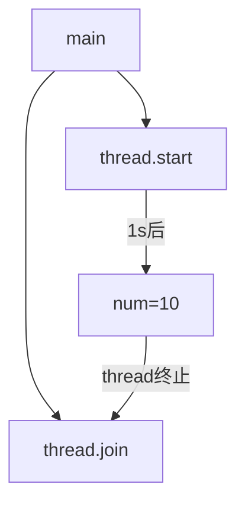
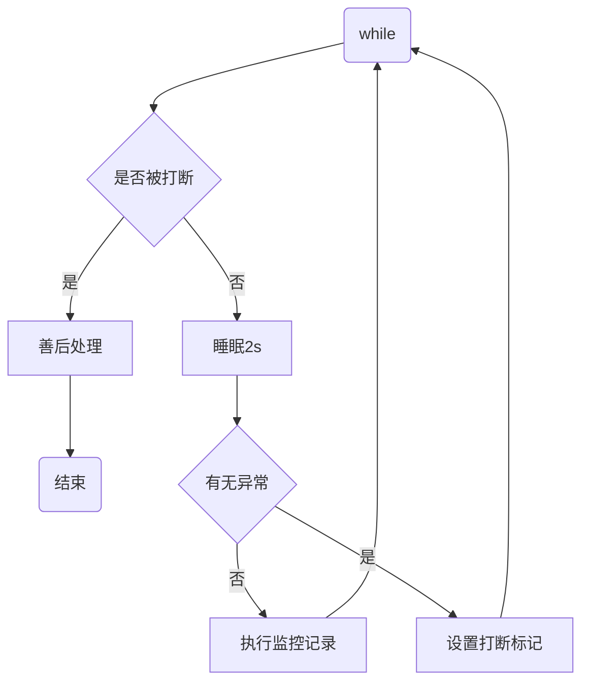
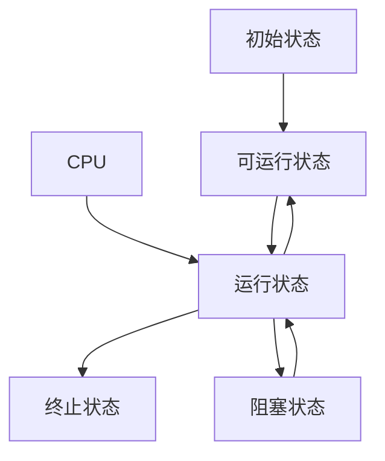

# Java并发编程

## 进程与线程

### 2.1 进程与线程的概念

**进程**

* 程序由指令和数据组成，但这些指令要运行，数据要读写，就必须将指令加载至CPU，数据加载至内存。在指令运行的过程中还需要用到磁盘，网络等设备。进程就是用来加载指令、管理内存、管理IO的。
* 当一个程序被运行，从磁盘加载这个程序的代码至内存，这时就开启了一个进程。
* 进程就可以视为程序的一个实例。大部分程序可以同时运行多个实例进程，也有的程序只能启动一个实例进程

**线程**

* 一个进程之内可以分为一到多个线程。
* 一个线程就是一个指令流，将指令流中的一条条指令以一定的顺序交给CPU执行
* Java中，线程作为最小调度单位，进程作为资源分配的最小单位。

**两者对比**

* 进程是相互独立的，而线程存在于进程内，是进程的一个子集

* 进程拥有共享的资源，如内存空间等，供其内部的线程共享

* 进程间通信较为复杂

  同一台计算机的进程通信称为 IPC (Inter-process communication)

  不同计算机之间的进程通信，需要通过网络，并遵守共同的协议，如HTTP

* 线程通信相对简单，因为他们共享进程的内存，例如：多个线程可以访问一个共享变量

* 线程更轻量，线程上下文切换成本一般要比进程上下文切换低

### 2.2 并行与并发

单核CPU下，线程实际是串行执行的。操作系统中有一个组件叫做任务调度器，将CPU的时间片分给不同的线程使用，只是由于CPU在线程间切换的非常快，人类感觉是同时运行的。总结为：**微观串行，宏观并行**

一般将这种**线程轮流使用CPU**的做法称为**并发**

**多核CPU**下，每个核都可以调度运行线程，这个时候线程是**并行**的

### 2.3 应用

**同步与异步**

* 需要等待结果返回才能继续运行就是同步
* 不需要等待结果返回就能继续运行的就是异步

注意：同步在多线程中还有另外一层意思，就是多个线程步调一致

**设计**

多线程可以让方法执行变为异步的，例如磁盘读取文件是，假设读取文件耗费5秒，如果没有线程调度机制这些时间调用者无法继续进行下面的操作。

**案例**

* tomcat的异步servlet，让用户线程处理耗时较长的操作，避免阻塞tomcat的工作线程
* UI程序中，开线程进行其他操作，避免阻塞UI线程


## 测试环境搭建

* 基准测试工具选择，使用JMH，它会进行程序预热，执行多次测试并平均

* 测试代码如下

  ```shell
  # 在一个空目录生成一个测试项目
  mvn archetype:generate -DinteractiveMode=false -DarchetypeGroupId=org.openjdk.jmh -DarchetypeArtifactId=jmh-java-benchmark-archetype -DgroupId=com.jenkov -DartifactId=first-benchmark -Dversion=1.0
  ```
## 创建和运行线程

### 常见的创建线程的方式

1. 继承Thread重写run方法
2. 实现Runnable接口
3. FutureTask方法

### 查看线程的方式

**Windows**

* 任务管理器可以查看进程和线程也可以杀死进程
* tasklist查看进程
* taskkill杀死进程

**Linux**

* ps -fe查看所有进程
* ps -fT -p <PID> 查看某个进程PID的所有线程
* kill 杀死进程
* top 按大写H切换是否显示线程
* top -H -p  <PID> 查看某个进程的所有线程

**Java**

* jsp命令查看所有java进程
* jstack <PID> 查看某个java进程的所有线程状态
* jconsole 来查看某个java进程中线程的运行情况（图形界面）

## 线程运行原理

### 3.1 栈与栈帧

Java Virtual Machine Stacks（Java 虚拟机栈）

我们都知道JVM中由堆、栈、方法区所组成，其中栈内存是给谁用的呢？其实就是线程，每个线程启动 
后，虚拟机就会为其分配一块栈内存。

* 每个栈由多个栈帧（Frame)组成，对应着每次方法调用时所占用的内存 
* 每个线程只能有一个活动栈帧，对应着当前正在执行的那个方法

### 3.2 线程上下文切换

因为以下一些原因导致cpu不再执行当前的线程，转而执行另一个线程的代码

* 线程的cpu时间片用完 
* 垃圾回收
* 有更离优先级的线程需要运行
*  线程自己调用了 sleep、yield、wait、join、park、synchronized、 lock 等方法程序

当Context Switch发生时，需要由操作系统保存当前线程的状态，并恢复另一个线程的状态，Java中对应的概念就是程序计数器（ Program Counter Register) , 它 的 作 用 是 记 住 下 一 条 jvm指令的执行地址#是线程私有的

* 状态包括程序计数器、虚拟机栈中每个栈的信息，如局部变量、操作数栈、返回地址等。
* Context Switch频繁切换会影响性能

### 3.3 常见方法

| 方法名           | 功能说明                                      | 注意                                                         |
| ---------------- | --------------------------------------------- | ------------------------------------------------------------ |
| start()          | 启动一个新线程，在新的线程运行run方法中的代码 | start方法只是让线程进入就绪，里面的代码不一定立即执行。每个线程的start方法只能调用一次，多次调用会抛IllegalThreadStateException |
| run()            | 新线程启动后会调用的方法                      | 如果在构造Thread对象的时候传递了Runnable参数，则线程启动后会调用Runnable中的run方法，否则默认不执行任何操作。但是可以创建Thread的子类对象来覆盖默认行为 |
| join             | 等待线程运行结束                              |                                                              |
| join(long n)     | 等待线程运行结束，最多等待n毫秒               |                                                              |
| getId()          | 获取线程长整型id                              | id唯一                                                       |
| getName()        | 获取线程名                                    |                                                              |
| setName(String)  | 修改线程名                                    |                                                              |
| getPriority()    | 获取线程优先级                                |                                                              |
| setPriority(int) | 修改线程优先级                                | Java中规定线程优先级1~10的整数，较大的优先级能提高该线程被CPU调度的机率 |
| getState()       | 获取线程状态                                  | Java中线程状态是用6个enum表示，分别为：NEW, RUNNABLE, BLOCKED, WAITING, TIMED_WAITING,TERMINATED |
| isInterrupted()  | 判断是否被打断                                | 不会清除`打断标记`                                           |
| isAlive()        | 线程是否存活（即还没有执行完毕）              |                                                              |
| interrupt()      | 打断线程                                      | 如果被打断线程正在sleep, wait, join 会导致樹的线程抛出InterruptedException，并删除`打断标记`；如果打断的正在运行的线程，则会设置`打断标记`；park的线程被打断，也 会设置`打断标记` |
| interrupted()    | 判断当前线程是否被打断                        | 会清除`打断标记`                                             |
| currentThread()  | 获取当前正在执行的线程                        |                                                              |
| sleep(long n)    | 让当前线程休眠n毫秒                           |                                                              |
| yield()          | 提示线程调度器让出当前线程对cpu的使用         | 主要用于测试和调试                                           |

**不推荐使用的方法**

| 方法名    | 功能说明             |
| --------- | -------------------- |
| stop()    | 停止线程运行         |
| suspend() | 挂起（暂停）线程运行 |
| resume()  | 恢复线程运行         |

#### 3.3.1 start 与 run

* run方法仅仅是方法调用不会创建新的线程，可以多次调用
* start方法会创建新线程执行方法，只能调用一次

#### 3.3.2 getState方法

* 获取线程的状态，java中有线程有六个状态。NEW, RUNNABLE, BLOCKED, WAITING, TIMED_WAITING,TERMINATED

#### 3.3.3 sleep和yield

**sleep**

* 调用 sleep 会让当前线程从 Running 进入 Timed Waiting 状态（阻塞）
* 其它线程可以使用 interrupt 方法打断正在睡眠的线程，那么被打断的线程这时就会抛出 InterruptedException异常【注意：这里打断的是正在休眠的线程，而不是其它状态的线程】
* 睡眠结束后的线程未必会立刻得到执行(需要分配到cpu时间片)
* 建议用 TimeUnit 的 sleep() 代替 Thread 的 sleep()来获得更好的可读

**yield**

* 调用 yield 会让当前线程从 Running 进入 Runnable 就绪状态，然后调度执行其它线程
* 具体的实现依赖于操作系统的任务调度器(就是可能没有其它的线程正在执行，虽然调用了yield方法，但是也没有用)

**yield使cpu调用其它线程，但是cpu可能会再分配时间片给该线程；而sleep需要等过了休眠时间之后才有可能被分配cpu时间片**

#### 3.3.4 线程优先级

线程优先级会提示（hint）调度器优先调度该线程，但它仅仅是一个提示，调度器可以忽略它 如果 cpu 比较忙，那么优先级高的线程会获得更多的时间片，但 cpu 闲时，优先级几乎没作用

#### 3.3.5 join方法

* 某个线程调用join方法会等待该线程执行结束再继续执行下面的代码
* 可以调用join(long n)方法来限定等待的最长时效




#### 3.3.6 interrupt方法

* interrupt方法用于打断sleep、wait、join的线程，线程抛出InterruptedException，打断标记为false
* interrupt方法打断一个正在执行的线程，线程不会停止，打断标记被置为true

### 3.4 设计模式应用

#### 3.4.1 两阶段终止模式

Two Phase Termination，就是考虑在一个线程T1中如何优雅地终止另一个线程T2？这里的优雅指的是给T2一个料理后事的机会（如释放锁）。

如下所示：那么线程的isInterrupted()方法可以取得线程的打断标记，如果线程在睡眠sleep期间被打断，打断标记是不会变的，为false，但是sleep期间被打断会抛出异常，我们据此手动设置打断标记为true；如果是在程序正常运行期间被打断的，那么打断标记就被自动设置为true。处理好这两种情况那我们就可以放心地来料理后事啦！



### 3.5 守护线程

默认情况下，java进程需要等待所有的线程结束后才会停止，但是有一种特殊的线程，叫做守护线程，在其他线程全部结束的时候即使守护线程还未结束代码未执行完java进程也会停止。普通线程t1可以调用`t1.setDeamon(true);` 方法变成守护线程

> 注意 垃圾回收器线程就是一种守护线程 Tomcat 中的 Acceptor 和 Poller 线程都是守护线程，所以 Tomcat 接收到 shutdown 命令后，不会等 待它们处理完当前请求

### 3.6 线程的五种状态

五种状态的划分主要是从操作系统的层面进行划分的



1. 初始状态，仅仅是在语言层面上创建了线程对象，即`Thead thread = new Thead();`，还未与操作系统线程关联
2. 可运行状态，也称就绪状态，指该线程已经被创建，与操作系统相关联，等待cpu给它分配时间片就可运行
3. 运行状态，指线程获取了CPU时间片，正在运行
   1. 当CPU时间片用完，线程会转换至【可运行状态】，等待 CPU再次分配时间片，会导致我们前面讲到的上下文切换
4. 阻塞状态
   1. 如果调用了阻塞API，如BIO读写文件，那么线程实际上不会用到CPU，不会分配CPU时间片，会导致上下文切换，进入【阻塞状态】
   2. 等待BIO操作完毕，会由操作系统唤醒阻塞的线程，转换至【可运行状态】
   3. 与【可运行状态】的区别是，只要操作系统一直不唤醒线程，调度器就一直不会考虑调度它们，CPU就一直不会分配时间片
5. 终止状态，表示线程已经执行完毕，生命周期已经结束，不会再转换为其它状态

### 3.7 线程的六种状态

这是从 Java API 层面来描述的，我们主要研究的就是这种

1. NEW 跟五种状态里的初始状态是一个意思
2. RUNNABLE 是当调用了 `start()` 方法之后的状态，注意，Java API 层面的 `RUNNABLE` 状态涵盖了操作系统层面的【可运行状态】、【运行状态】和【io阻塞状态】（由于 BIO 导致的线程阻塞，在 Java 里无法区分，仍然认为是可运行）
3. `BLOCKED` ， `WAITING` ， `TIMED_WAITING` 都是 Java API 层面对【阻塞状态】的细分，后面会在状态转换一节 详述