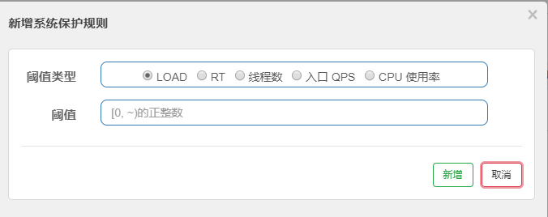

# springcloud alibaba学习

## 一、nacos相关

### 1.1 使用nacos作为注册中心

使用nacos注册中心首先要安装好nacos，可以从github获取启动包或者获取源代码手动构建进行安装（推荐后者比较快）nacos可以使用数据库来持久化信息

**使用nacos做注册中心需要**

1. 在项目中引入nacos相关依赖

   ```xml
   <dependency>
       <groupId>com.alibaba.cloud</groupId>
       <artifactId>spring-cloud-starter-alibaba-nacos-discovery</artifactId>
   </dependency>
   ```

2. 在配置文件中指定nacos的地址

   ```yml
   spring:
     application:
       name: nacos-payment-provider
     cloud:
       nacos:
         discovery:
           server-addr: 47.113.104.65:8848 #配置Nacos地址
   ```

**nacos集成了ribbon，所以nacos自带了负载均衡功能，支持ribbon+rest template进行rest风格服务调用**

### 1.2 使用nacos作为配置中心

**使用nacos作为配置中心需要**

1. 引入nacos配置相关依赖

   ```xml
   <dependency>
       <groupId>com.alibaba.cloud</groupId>
       <artifactId>spring-cloud-starter-alibaba-nacos-config</artifactId>
   </dependency>
   ```

2. 在配置文件中进行配置

   ```yml
   spring:
     application:
       name: nacos-config-client
     cloud:
       nacos:
         discovery:
           server-addr: 47.113.104.65:8848 #Nacos服务注册中心地址
         config:
           server-addr: 47.113.104.65:8848 #Nacos作为配置中心地址
           file-extension: yml  #指定yaml格式的配置
           group: DEV_GROUP
           #group: DEV_GROUP
           namespace: e69dbe0a-233d-4b73-a173-89e9e8a1d041
   ```

**nacos配置中心文件DataID命名规则**

项目名称+环境+文件后缀

>${spring.application.name}-${spring.profile.active}.${spring.cloud.nacos.config.file.extension}
>
>nacos-config-client-dev.yml

**nacos 命名空间、分组和DataID三者的关系**

这三者之间的关系类似于Java中的package名和类名

最外层的namespace是可以用于区分部署环境的，Gruop和DataID逻辑上区分两个目标对象


**DataID配置**

通过相同的分组不同的文件名来区分不同的环境

指定spring.profile.active和配置文件的DataID来使不同环境下读取不同的配置

在同一分组下新建多个环境的配置文件如：nacos-config-client-dev.yml、nacos-config-client-test.yml

在项目application.yml配置文件中指定生效的配置文件

```yml
spring:
  profiles:
    active: dev #开发环境
    #active: test #测试环境
    #active: info
```

**Group分组方案**

通过部分的分组相同的文件名来进行不同环境的区分

新建分组例如：DEV_GROUP、TEST_GROUP，在分组下新建配置文件nacos-config-client-info.yml

在bootstrap.yml配置文件的config下指定分组即可

```yaml
spring:
  application:
    name: nacos-config-client
  cloud:
    nacos:
      discovery:
        server-addr: 47.113.104.65:8848 #Nacos服务注册中心地址
      config:
        server-addr: 47.113.104.65:8848 #Nacos作为配置中心地址
        file-extension: yml  #指定yaml格式的配置
        group: DEV_GROUP
        #group: TEST_GROUP
```

```yaml
spring:
  profiles:
    active: info
```

**Namespace空间方案**

通过不同的命名空间+分组+DataID来区分不同的环境

在配置文件中指定使用特定的命名空间中的配置文件，否则使用默认空间的配置文件

```yaml
spring:
  application:
    name: nacos-config-client
  cloud:
    nacos:
      discovery:
        server-addr: 47.113.104.65:8848 #Nacos服务注册中心地址
      config:
        server-addr: 47.113.104.65:8848 #Nacos作为配置中心地址
        file-extension: yml  #指定yaml格式的配置
        group: DEV_GROUP      
        namespace: e69dbe0a-233d-4b73-a173-89e9e8a1d041
```

### 1.3 nacos集群和持久化

**如何持久化**

1. 在mysql中新建数据库，执行conf目录下的nacos-mysql.sql脚本

2. 修改conf目录下的application.properties文件,在配置文件最后添加数据库配置

   ```properties
   # 数据库
   spring.datasource.platform=mysql
   db.num=1
   db.url.0=jdbc:mysql://127.0.0.1:3306/nacos?characterEncoding=utf8&connectTimeout=1000&socketTimeout=3000&autoReconnect=true
   db.user=root
   db.password=******
   ```

3. 重新启动nacos，nacos中产生的数据即会保存到数据库中

**集群配置**

完成了持久化后多个（三个及以上）nacos服务器使用同一个数据库进行集群化部署

使用nginx（即下图VIP部分）进行反向代理，在项目中原先配置的注册中心地址替换为nginx地址。

[官方部署说明][https://nacos.io/zh-cn/docs/cluster-mode-quick-start.html]


## 二、Sentinel相关

随着微服务的流行，服务和服务之间的稳定性变得越来越重要。Sentinel 以流量为切入点，从流量控制、熔断降级、系统负载保护等多个维度保护服务的稳定性。

Sentinel 具有以下特征:

- **丰富的应用场景**：Sentinel 承接了阿里巴巴近 10 年的双十一大促流量的核心场景，例如秒杀（即突发流量控制在系统容量可以承受的范围）、消息削峰填谷、集群流量控制、实时熔断下游不可用应用等。
- **完备的实时监控**：Sentinel 同时提供实时的监控功能。您可以在控制台中看到接入应用的单台机器秒级数据，甚至 500 台以下规模的集群的汇总运行情况。
- **广泛的开源生态**：Sentinel 提供开箱即用的与其它开源框架/库的整合模块，例如与 Spring Cloud、Dubbo、gRPC 的整合。您只需要引入相应的依赖并进行简单的配置即可快速地接入 Sentinel。
- **完善的 SPI 扩展点**：Sentinel 提供简单易用、完善的 SPI 扩展接口。您可以通过实现扩展接口来快速地定制逻辑。例如定制规则管理、适配动态数据源等。

### 2.1 Sentinel和hystrix的区别

| Hystrix                                                      | Sentinel                 |
| ------------------------------------------------------------ | ------------------------ |
| 需要我们自己手动搭建监控平台Zipkin                           | 单独一个组件可以独立出来 |
| 没有一套web界面可以给我们进行更细粒度化的配置<br>例如：流量控制、速率控制、服务熔断、服务降级...... | 直接界面化细粒度统一配置 |

### 2.2 如何使用Sentinel

1. 在项目中引入Sentinel相关依赖

   ```xml
   <!--springcloud alibaba sentinel-->
   <dependency>
       <groupId>com.alibaba.cloud</groupId>
       <artifactId>spring-cloud-starter-alibaba-sentinel</artifactId>
   </dependency>
   ```

2. 配置文件中配置Sentinel-dashboard服务器地址

   ```yaml
   spring:
     application:
       name: cloudalibaba-sentinel-service
     cloud:
       nacos:
         discovery:
           # Nacos服务注册中心地址
           server-addr: 47.113.104.65:8848
       sentinel:
         transport:
           # sentinel dashboard 地址
           dashboard: 47.113.104.65:8080
           # 默认为8719，如果被占用会自动+1，直到找到为止
           port: 8719
         # 流控规则持久化到nacos
         datasource:
           dsl:
             nacos:
               server-addr: 47.113.104.65:8848
               data-id: ${spring.application.name}
               group-id: DEFAULT_GROUP
               data-type: json
               rule-type: flow
   ```

### 2.3 Sentinel流控规则

有两个添加流控规则的入口

在**簇点链路**模块选择资源，对该资源添加流控规则

在**流控规则**模块添加流控规则

**流控模式**

* 直接：api达到限流条件时，直接限流
* 关联：当关联的资源达到阈值时，就限流自己
* 链路：只记录指定链路上的流量（指定资源从入口资源进来的流量，如果达到阈值，就进行限流）【API级别的针对来源】

**流控效果**

* 快速失败：直接失败，抛异常
* Warm Up：根据codeFactor（冷加载因子，默认3）的值，从阈值/codeFactor，经过预热时长，才达到设置的QPS阈值
* 排队等待：

1. QPS直接失败

   如果每秒访问量超过设置的单机阈值就直接返回失败：Blocked by Sentinel (flow limiting)

2. 线程数直接失败

   对应使用线程失败的情况，线程数是限制对应资源创建线程的数量，线程是可复用的，在线程能出来的范围内不会失败。

3. 关联：当B资源的访问超过每秒一次A资源限流自己

   

4. 预热：默认coldFactor为3，即QPS从（threshold/3）此处为10/3=3开始，经过5秒预热逐渐达到10的阈值

   

5. 排队等待：每秒处理一个请求，后面的请求排队等待，超时时间20000ms

   

### 2.4 Sentinel服务降级

**降级策略**

1. RT：平均响应时间 （超出阈值且在时间窗口内通过的请求数>=5，两个条件同时满足触发降级）

   时间窗口内平均响应时间超过200ms服务降级

   

2. 异常比例：QPS>=5且异常比例（秒级统计）超过阈值，触发降级；时间窗口期结束后，关闭降级

   时间窗口内异常比例超过20%，未来3秒不可用

   

3. 异常数：（分钟统计）超过阈值时触发降级；时间窗口结束后关闭降级。

   一分钟内异常数超过5，时间窗口内服务降级

   

### 2.5 Sentinel热点规则

第0个参数，阈值为1的热点限流（超过一秒一次请求就使用兜底方法处理）


**参数例外项**

即如果参数是某种类型的某个值时，其限流阈值单独设置

参数是string类型的5时，阈值为200


### 2.6  Sentinel系统规则


在系统级维度进行限流控制，对全部的资源都使用该规则（一般不使用）



### 2.7 Sentinel服务熔断

sentinel整合ribbon+openfeign+fallback

服务熔断的配置一般有一下几种情况

1. 无配置

   没有配置的情况如果出现异常会直接将异常抛给用户，体验不是很好

   ```java
   @SentinelResource(value = "fallback") //没有配置
   ```

2. 只配置fallback

   java运行时异常归fallback处理，相当于hystrix的服务降级

   ```java
    //配置了fallback的，fallback只负责业务异常
   @SentinelResource(value = "fallback",fallback = "handlerFallback")
   ```

3. 只配置blockHandler

   blockHandler不出来运行时异常，只负责处理违反了sentinel规则的情况

   ```java
   // 配置了blockHandler，只负责sentinel控制台配置违规
   @SentinelResource(value = "fallback",blockHandler = "blockHandler") 
   ```

4. fallback和blockHandler都配置

   同时配置两个可以处理运行时异常和违反配置规则的情况

   exceptionsToIgnore:需要忽略的异常

   ```java
   // 配置了blockHandler和fallback
   @SentinelResource(value = "fallback",fallback = "handlerFallback", 
                     blockHandler = "blockHandler",
               exceptionsToIgnore = {IllegalArgumentException.class}) 
   ```

   

**sentinel持久化规则**

将限流规则持久化进nacos保存，只要刷新8401的某个rest地址，sentinel控制台的流控规则就能看到，只要nacos里面的配置不删除，针对8401上sentinel上的流控规则持续有效

操作步骤

1. 新增sentinel将数据整合到nacos相关依赖

   ```xml
   <!--springcloud alibaba sentinel-datasource-nacos 后续做持久化用到-->
   <dependency>
       <groupId>com.alibaba.csp</groupId>
       <artifactId>sentinel-datasource-nacos</artifactId>
   </dependency>
   ```

2. yml配置文件中新增nacos数据源配置

   ```yaml
   spring:
     application:
       name: cloudalibaba-sentinel-service
     cloud:
       nacos:
         ...
       sentinel:
        ...
         # 流控规则持久化到nacos
         datasource:
           dsl:
             nacos:
               server-addr: 47.113.104.65:8848
               data-id: ${spring.application.name}
               group-id: DEFAULT_GROUP
               data-type: json
               rule-type: flow
   ```

3. 添加nacos业务规则配置

   配置列表新增配置规则Data Id 跟应用的名称保持一致（例：cloudalibaba-sentinel-service）类型为JSON，编辑配置内容。

   ```json
   [{
   	"resource": "/rateLimit/byUrl",
   	"limitApp": "default",
   	"grade": 1,
   	"count": 1,
   	"strategy": 0,
   	"controlBehavior": 0,
   	"clusterMode": false
   }]
   ```

## 三、Seata相关

分布式事务的问题

​	单体应用被拆分为微服务应用，原来的模块被拆分为独立的应用，使用独立的数据源，业务操作需要调用多个微服务来完成，此时每个服务内部的数据一致性由本地事务来保证，但是全局的数据一致性问题没有办法保证。

### 3.1 相关术语

**TC - 事务协调者**

维护全局和分支事务的状态，驱动全局事务提交或回滚。

**TM - 事务管理器**

定义全局事务的范围：开始全局事务、提交或回滚全局事务。

**RM - 资源管理器**

管理分支事务处理的资源，与TC交谈以注册分支事务和报告分支事务的状态，并驱动分支事务提交或回滚。

### 3.2 处理流程


### 3.3 环境构建

1. 下载seata压缩包

2. 修改file.conf配置文件（自定义事务组名称+事务日志存储模式为db+数据库连接信息）

   ```
   ##修改服务名
   service {
     #vgroup->rgroup
     vgroup_mapping.my_test_tx_group = "fsp_tx_group"
     #only support single node
     default.grouplist = "127.0.0.1:8091"
     #degrade current not support
     enableDegrade = false
     #disable
     disable = false
     #unit ms,s,m,h,d represents milliseconds, seconds, minutes, hours, days, default permanent
     max.commit.retry.timeout = "-1"
     max.rollback.retry.timeout = "-1"
   }
   ```

   ```
   ##修改事务日志存储模式为db
   store {
     ## store mode: file、db
     mode = "db"
     ...
     ## database store
     db {
       ## the implement of javax.sql.DataSource, such as DruidDataSource(druid)/BasicDataSource(dbcp) etc.
       datasource = "dbcp"
       ## mysql/oracle/h2/oceanbase etc.
       db-type = "mysql"
       driver-class-name = "com.mysql.jdbc.Driver"
       url = "jdbc:mysql://127.0.0.1:3306/seata"
       user = "root"
       password = "970708"
       min-conn = 1
       max-conn = 3
       global.table = "global_table"
       branch.table = "branch_table"
       lock-table = "lock_table"
       query-limit = 100
     }
   }
   ```

3. 修改registry.conf注册配置文件（将seata注册到nacos中）

   ```
   registry {
     # file 、nacos 、eureka、redis、zk、consul、etcd3、sofa
     type = "nacos"
   
     nacos {
       serverAddr = "localhost:8848"
       namespace = ""
       cluster = "default"
     }
     eureka {
       serviceUrl = "http://localhost:8761/eureka"
       application = "default"
       weight = "1"
     }
     ...
    }
   ```

   后台启动命令

   ```shell
   nohup ./seata-server.sh >log.out 2>1 &
   ```

   

   